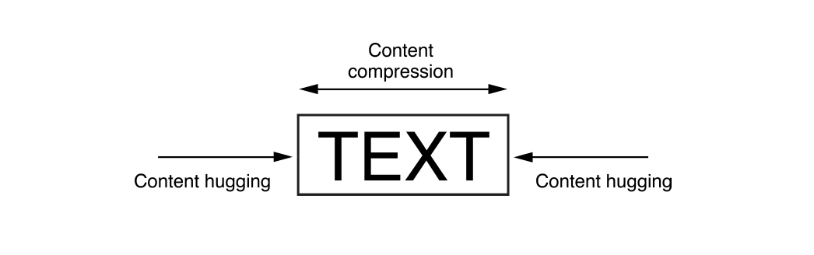
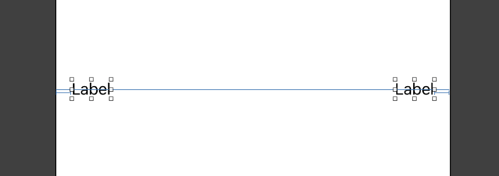

# Intrinsic Size & Priority

## intrinsicContentSize

intrinsicContentSize(이하 intrinsicSize)란 뷰가 가지고 있는 본연의 사이즈를 말합니다. 

커스텀뷰는 일반적으로 레이아웃 시스템이 알지 못하는 방식으로 표시가 됩니다. 따라서 프로퍼티를 설정하여 콘텐츠에 맞춰서 사이즈를 시스템에 전달할 수 있도록 해야합니다. 일반적으로 커스텀뷰의 경우 내부의 콘텐츠를 레이아웃 시스템에 맞춰서 사이즈를 정해야 합니다. 이 사이즈는 변경된 높이를 기반으로 변경된 너비를 레이아웃시스템에 전달할 방법이 없기 때문에, 반드시 frame과는 무관해야 합니다.

---

대표적으로 intrinsicSize 를 갖고 있는 뷰로 UILabel 을 예시로 들수 있습니다. 자체적으로 Text 사이즈를 통해서 Label의 사이즈를 정하기 때문입니다. 따라서 UILabel 는 center를 superview 와 동일하게 잡기만 해도 layout 이 제대로 잡히는 것을 볼 수 있습니다. 이는 UIImageView 또한 마찬가지입니다.

반면에 intrinsicSize를 제대로 갖고 있지 않는 뷰의 경우는 center를 superview에 동일하게 잡더라도, 해당 뷰의 사이즈를 측정할 수 없기 때문에 layout 에러가 발생합니다. 레이아웃 시스템이 판단할 수 없기 때문입니다.

하지만 이렇게 intrinsicSize이 존재하더라도 복잡한 레이아웃이 되는 경우는 시스템이 판단할 수 없는 경우가 종종 있습니다. 이 경우를 해결하기 위해서 애플에서는 CompressionResistancePriority, HuggingPriority 를 제시하여 해결할 수 있도록 하였습니다.

## contentCompressionResistancePriority

## contentHuggingPriority

## Reference 

https://developer.apple.com/library/archive/documentation/UserExperience/Conceptual/AutolayoutPG/ViewswithIntrinsicContentSize.html

https://developer.apple.com/documentation/uikit/uiview/1622600-intrinsiccontentsize

https://developer.apple.com/documentation/uikit/uiview/1622526-setcontentcompressionresistancep

https://developer.apple.com/documentation/uikit/uiview/1622485-setcontenthuggingpriority

 