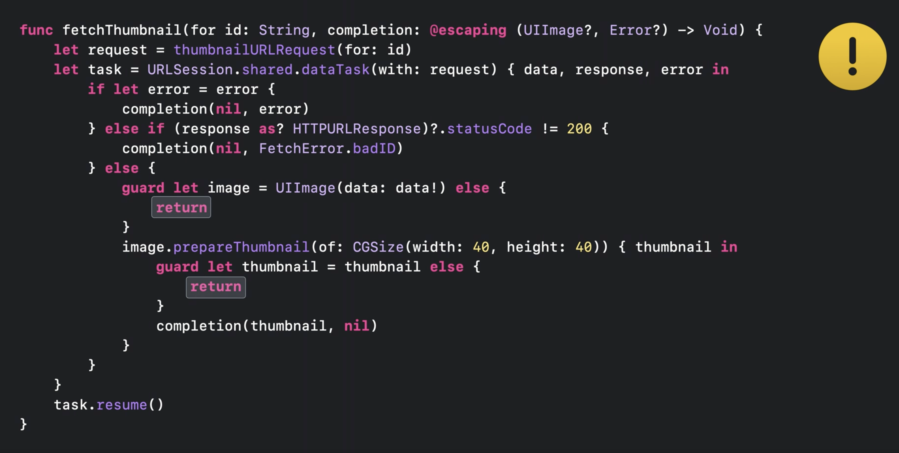
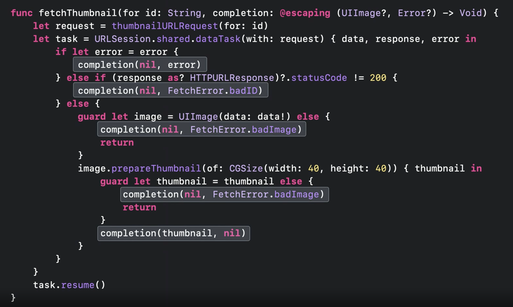
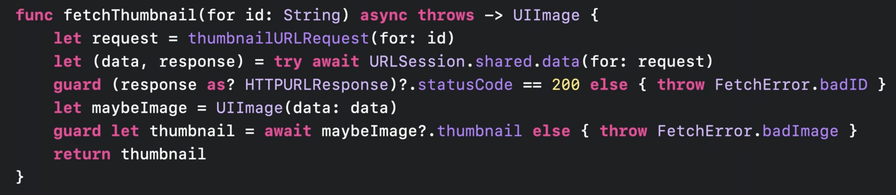
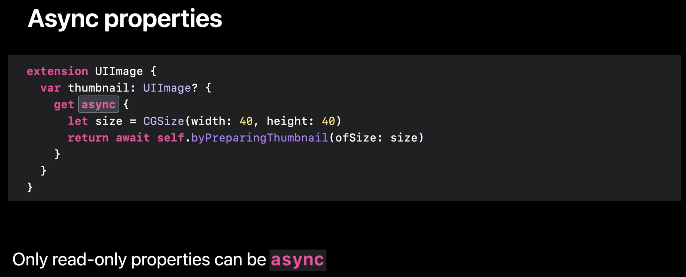
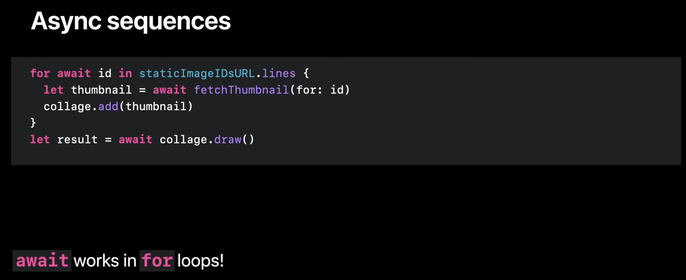
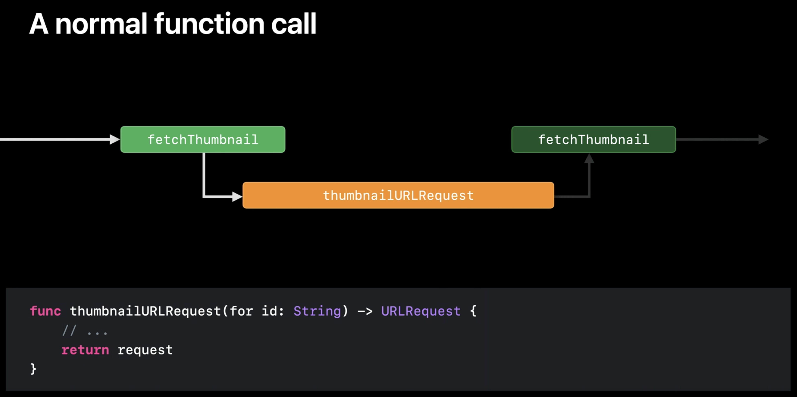
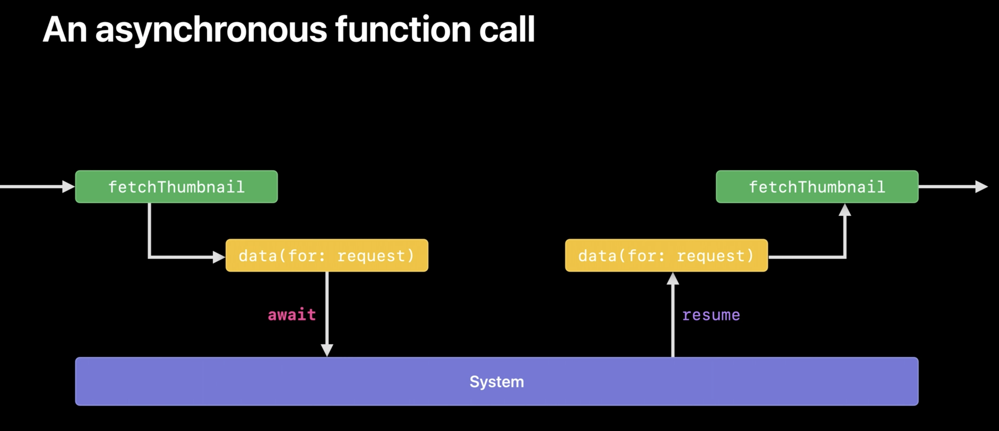
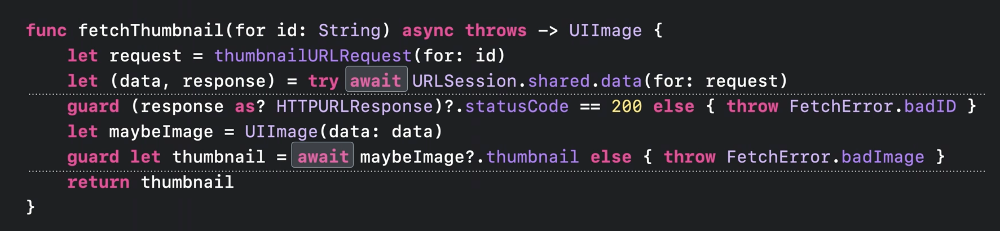

# [ WWDC21 ] Meet async / await in swift

이번 WWDC 에서 재밌었던 부분중 하나가 Concurrency 에 대한 세션이 아니었나 생각합니다. 이번에는 그중 가장 기본적인 async 그리고 await 에 대해서 설명한 [Meet async / await in swift](https://developer.apple.com/videos/play/wwdc2021/10132/) 세션에 대해서 한번 정리해보겠습니다. 주제를 나눈 기준은 세션을 참고한것이 아닌 제 주관적인 생각으로 나누었으니 이 점 꼭 참고하시길 바랍니다!

## basic of synchronous / asynchronous

이제는 비동기 프로그래밍은 일반 사용자( 프로그래머 )에게 필수적이고 일반적인 요소가 되었고 많이 사용하고 있습니다. 하지만 그만큼 잘못 사용하는 경우도 많이 봤었는데, 이런 상황들을 async/awit 를 통해서 어느정도 해결할 수 있을 것이라고 기대합니다. 마치 기존 동기 코드를 작성하는 것 처럼 비동기 코드 또한 작성할 수 있을 것입니다.

UIImage 의 prepareThumbnail 함수를 예를 들어서 설명해보겠습니다. 이 함수는 작동하는 방식에 따라서 두가지로 나뉘어집니다. preparingThumbnail(of:) 를 통해서 동기적으로 작동하는 코드를 작성할 수 있으며, prepareThumbnail(of:completionHandler:)를 통해서 비동기적으로 작동하는 코드를 작성할 수 있습니다.

동기적으로 작동하는 코드의 경우를 조금 더 깊게 살펴본다면 임의의 thread가 해당 작업을 맡게 되고, image를 준비해서 리턴을 할때까지 해당 thread 는 다른 일을 할 수 없는 block 상태가 됩니다. 반면에 completion handler를 통한 비동기적으로 작동하는 코드에서는 얘기가 달라집니다. 해당 작업을 처리하는 thread 에서는 내부적으로 긴 작업 ( 네트워크 작업 )을 요청하고 나서 최대한 빠르게 다른 작업을 할 수 있는 상태가 되려고 합니다. 요청을 한 작업이 끝날때 까지 다른 일들을 처리하고 있다가 요청이 끝난 경우 completion handler를 통해서 알림을 받고 해당 작업을 다시 처리하게 됩니다.

대부분 비동기 코드는 이런 방식으로 처리됩니다. 어떤 작업을 요청하고 해당 thread는 일단 다른 일들을 처리하고 있다가, 나중에 요청이 들어오게 되면 그제서야 처리하는 방식입니다. 이런 방식을 통해서 오래걸리는 작업이라고 하더라도 효율적으로 thread(자원)을 처리할 수 있게 됩니다.

## weakness of completion handler

이렇게 기존에 비동기 코드를 사용할때는 보통 escaping closure 를 활용한 completion handler를 사용했습니다. 인자로서 input 을 받고 이후에 caller에게 응답을 전달하기 위한 completion handler 또한 받는 방식으로 처리합니다. 하지만 이 방식을 사용하면서 몇가지 문제점을 발견했습니다.

### 첫번째, 예외처리

completion handler는 기본적으로 처리하지 않아도 컴파일단에서 에러가 발생하지 않습니다. 하지만 프로그래머라면 데이터를 처리하면서 데이터를 받는 것 만큼 에러를 받았을 때도 적절하게 처리할 수 있어야 합니다. 만약 사용자가 실수를 하게 되어 guard else 구문을 통해서 단순히 return을 하게 되는 경우는 어떻게 될까요? caller 입장에서는 completion handler를 통한 적절한 notification을 받을 수 없습니다. 어떤 방식으로도 제대로 처리하지 않으며 최악의 시나리오에서는 스피너가 계속 animating하는 UI가 나타날 수도 있습니다. 이런 상황을 살펴보게 된다면 현재 필수적으로 completion handler를 처리하는 방식이 현재 Swift에는 존재하지 않고 문제가 발생할 수 있습니다.

### 두번째, 코드의 중복 혹은 복잡성

이 함수를 적절하게 처리하기 위해서 사용되는 completion handler의 수는 5번입니다. 이렇게 코드가 길어지게 되면 읽기가 힘들어집니다. 또한 caller에서 버그가 발생한 경우 해당 함수를 찾고 5번의 completion handler를 찾아서 분산된 집중력으로 이를 확인해야 합니다. 결국 처리하기에 적절하지 못한 코드라고 할 수 있습니다.

물론 기존의 Result 를 통해서 코드를 감싼다면 처리가 조금 나아질 수는 있지만, 결국 코드가 조금 더 못생겨지며 길어지게 됩니다. 이러한 방식 또한 깔끔하고 쉽고 그리고 안전하게 처리하지는 못한다고 생각합니다.

## meet async / await

이렇게 위에서 발생한 문제점들을 최대한 깔끔하게 해소하기 위해서 async / await를 만들었습니다. 기존의 completion hanlder에 비해서 훨씬 더 깔끔하고 간단해진 것을 확인할 수 있습니다. 세가지 부분에 집중해보겠습니다.

첫번째로, 가장 크게 변한점은 인자에 completion handler 대신 async throws 키워드가 들어간 것입니다. 기존에 사용하던 방식에서는 input 그리고 completion handler를 동시에 받아서 처리했습니다. 하지만 async await 방식에서는 필요한 인자만 받을 수 있습니다. 또한 에러가 발생한 경우를 확인하기 위해서 async 키워드 뒤에 throws를 작성합니다. 이때 만약 에러를 throws 하지 않는다면 async 키워드만 function arrow 앞에 써도 무방합니다. 이 방식을 통해서 함수를 작성했을 때 함수 내부에서 Image를 성공적으로 만들어낸다면 UIImage 를 리턴할 것이고 그렇지 못한 경우는 error를 throws 할 것입니다.

두번째로, try await를 살펴보겠습니다. dataTask 메소드와 달리 [data 메소드](https://developer.apple.com/documentation/foundation/urlsession/3767352-data)는 awaitable method 입니다. 따라서 data 메소드가 호출되면 자신의 thread 를 최대한 빠르게 unblocked 함으로써 다른 곳에서 해당 쓰레드를 활용할 수 있도록 합니다. 이때 try 가 붙은 이유는 data method가 에러를 throw 할 수 있는 메소드 이기 때문입니다. 즉 정리하면 try 키워드는 throws와 연결되고 await 키워드는 async와 연관이 지어지는 것을 확인할 수 있습니다. 그렇기 때문에 상단에 async throws를 사용할 수 있습니다.

그렇다면 결과는 어떻게 받을까요? 이렇게 data(awaitable method)를 통해서 작업을 요청했을 때 만약 에러가 발생한다면 throws를 하게 될 것이고 정상적으로 response 가 온다면 (data, response)가 초기화 됩니다.

세번째로, thumbnail 프로퍼티 입니다. 여기에서 await 키워드를 작성 했는데 else 구문을 통해서 error를 throw 해준 것을 확인할 수 있습니다. 이 부분은 뒤에서 조금 더 자세하게 설명하겠습니다.

위와 같은 과정을 통해서 async / await를 사용한다면 비동기 작업을 처리할 때 데이터를 전달하거나 에러를 전달하는 것 둘중 하나를 확실하게 할 수 있도록 처리할 수 있습니다. 다시말해서 실수로 인해서 조용히 실패하는 경우가 없게 됩니다.

## Async Properties

여기서 세번째 부분을 디테일하게 들어가보겠습니다. maybeImage?.thumbnail 을 await로 처리한 부분이 보이시나요? method가 아닌 property인데 어떻게 이런 방식으로 처리를 할 수 있었을까요?

그 답은 property 자체를 async 하게 선언할 수 있기 때문입니다. Async Properties라고 하며, 이를 위해서는 뒤에 async 키워드가 붙은 getter를 명백하게 구현해주어야 합니다. 해당 프로퍼티는 setter를 설정할 수 없으며, read-only 프로퍼티로 입니다. 이를 통해서 property에서도 error를 throw할 수 있도록 작성할 수 있습니다.

함수, 프로퍼티, 이니셜라이저 등 다양한 곳에서 thread 를 block 하지 않도록 async / await 를 사용할 수 있습니다. 이는 for loop 에서도 Async sequences라는 방식으로 처리됩니다. 조금 더 다양한 관점에서 살펴보고 싶다면 아래의 WWDC 세션을 참고해보는 것이 좋을 것 같습니다.

- Meet AsyncSequence ( WWDC 21 )
- Explore structured concurrency in Swift ( WWDC 21 )

## Thread and function

일반적으로 synchronous function을 호출한다는 것은 임의의 thread가 대표해서 해당 함수를 실행시키고 컨트롤 하는 것입니다. 따라서 해당 thread 가 함수를 계속 대표해서 컨트롤하게 되며, 이 컨트롤을 끝내는 순간은 해당 함수를 return 하는 경우입니다.

하지만 asynchronous function이라면 얘기가 달라지게 됩니다. 동기 함수와 다르게 비동기 함수에서는 suspending이라는 방식을 통해서 thread 에서 해당 함수의 컨트롤을 포기할 수 있도록 합니다. 이는 해당 thread가 컨트롤에 대한 권한을 내려놓고 시스템에 넘기는 것입니다. 이때 함수가 Suspended 됩니다. 즉 Suspending 이란 함수가 시스템에게 권한을 넘기겠다고 말하는 방식입니다. 이때 시스템에서는 해당 함수를 바로 실행시키는 것이 아니라, 여유가 되는 경우 자원을 할애해서 작업을 처리하고 다시 함수로 resume하게 됩니다. 이때 비로소 함수로 다시 임의의 thread가 권한을 갖고 실행하게 됩니다.

주의해야할 점은 위에 보이는 것과 같이 두개의 async 작업을 하는 경우 해당 작업들을 동일한 thread에서 한다는 보장이 없다는 것입니다. 따라서 이런 Thread safe 관점에서 데이터를 보호하고 싶다면 아래의 세션을 참고하는 것이 좋습니다.

- Protect mutable state with Swift actors ( WWDC 21 ) 

## Summary

중요한 점을 강조하자면 다음과 같습니다.

- async를 붙인다는 것은 함수를 suspending 할 수 있는 상태로 둔다는 것입니다. 이때 함수 자체가 suspended 된다면 caller 또한 suspended 된다는 것이며, caller 또한 async 가 되어야 합니다.
- await 를 붙이는 곳은 async 함수가 실행을 suspended 할 수 있는 곳입니다.
- async 함수가 suspended 된다는 것은 thread 가 block 되는 것이 아닙니다. 또한 시스템 상황에 따라서 함수의 실행 시기는 달라질 수 있습니다. ( 시스템이 여유로우면 빨리 실행되지만, 그렇지 않으면 느릴 수도 있다는 말 )
- async 함수가 resume 된다는 것은 호출했던 함수로 다시 돌아가 기존의 플로우를 다시 실행한다는 것 입니다.

## 마무리

해당 포스트는 세션의 2/3 정도를 정리한 내용입니다. 이후의 내용은 실제로 어떻게 적용할 것인지에 대한 내용입니다. 이까지 포함할까 고민하다가 너무 길어지게 되고, 이번에는 async await를 소개하는 세션이라고 판단하여 이부분은 스킵하였습니다. 만약에 이에 대한 내용이 궁금하시다면 해당 세션을 참고하거나 Swift concurrency : Behind the scenes 세션을 참고하시길 바랍니다.

아직 async await를 적용하기에는 굉장히 시기상조라고 생각합니다. 실제로 data와 같은 awaitable method 또한 iOS 15+ beta로 표기되어 있습니다. 하지만 미리 이러한 키워드를 알아두고 공부하는 것이 좋다고 생각하여 정리하였습니다. 중간에 잘못 생각한 부분이 있다면 댓글 남겨주시면 감사하겠습니다!

