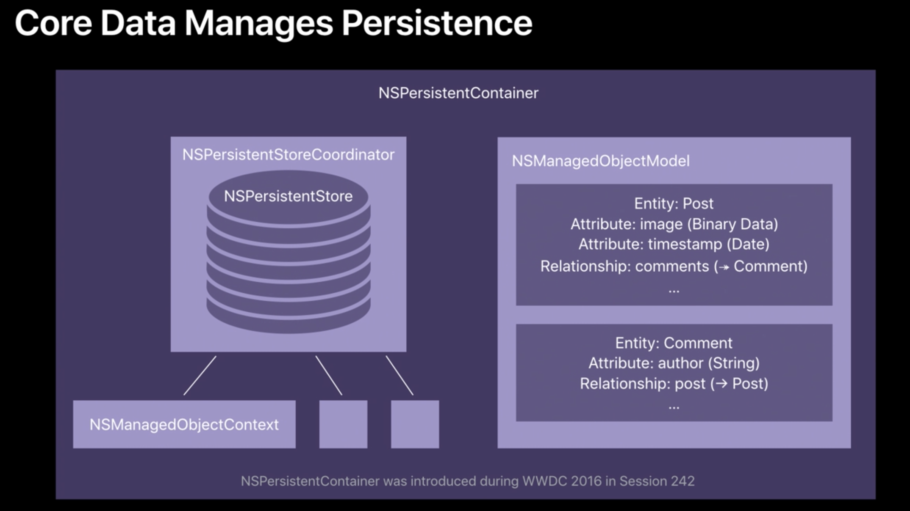
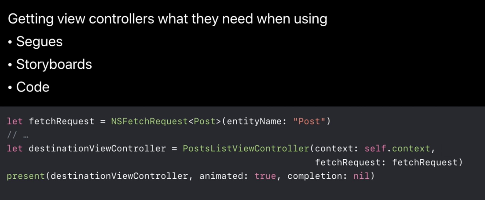
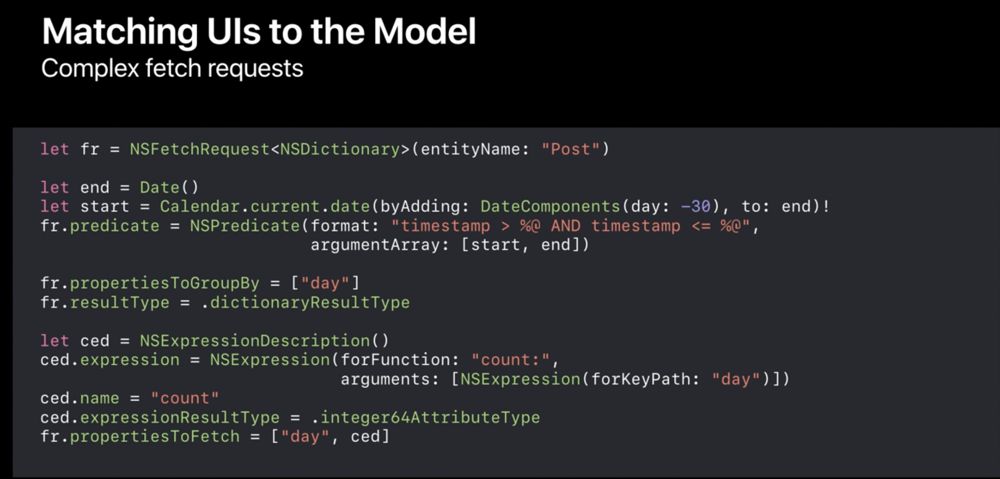
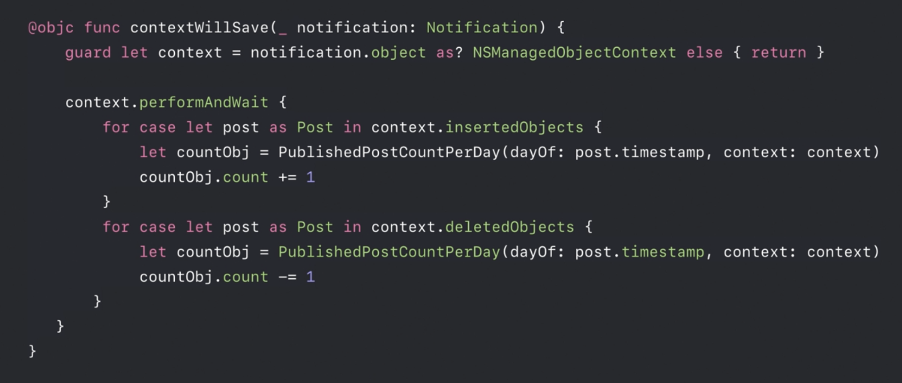
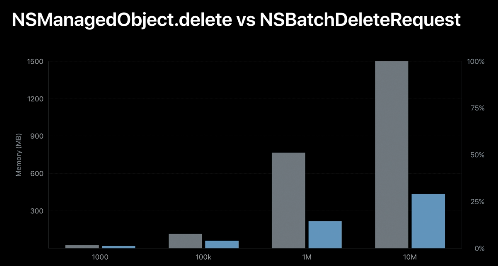

# 2018 Best Practice CoreData

[Core Data Best Practices - WWDC 2018 - Videos - Apple Developer](https://developer.apple.com/videos/play/wwdc2018/224/)

Core Data 의 대략적인 개념을 알고 앱을 개발하기 위해서 해당 영상을 시청하였다.

## Modernizing Core Data

Object Graph Persistence → Core Data 라고 이해할 수 있으며,  객체들 사이에 관계를 나타낸다.

해당 관계도를 CoreData Stack 이라고 하는데 자세한 설명은 문서를 찾아봐야 할 듯 하다. Object Model 로 각 객체 들을 정의한다. 중간에 coordinator, context 등이 포함되어 있다. 그리고 마지막으로 실제로 저장되는 PersistentStore가 있다.

coordinator 는 버전 별로 모델을 분리하거나 migrate 등을 할 수 있는 기능을 갖추고 있다.  그 다음 context를 통해서 빠르고 안전하게 데이터에 접근할 수 있도록 한다. 대부분 factory method를 통해서 행동들을 관리한다는 것을 알아 두자

## Matching models with views

fetched result controller를 사용하면 조금 더 효율적으로 data를 관리할 수 있다. model object와 viewController를 결합한 형태이다. 각각 model, parameter 를 받아서 설정하며 뷰를 손쉽게 관리할 수 있는 기능들이 있다. fetched result controller는 UI에 적절할 뿐만 아니라 유틸리티로써 사용하기에도 적합하다. 

해당 뷰 컨트롤러를 일반화 하기 위해서는 fetchRequest 를 만들고 VC에 context와 함께 넘겨주면 된다. 

만약에 날짜별로 몇개의 데이터가 있는지 확인하고 싶은 경우는 어떻게 할까? 이렇게 복잡한 request 또한 준비되어 있다. 해당 코드는 range를 설정하고 , 어떤 프로퍼티를 통해서 group화 시킬 것인지 설정한 뒤, 어떤 형식으로 결과를 나타낼 것인지 표현한 코드이다. 특히 결과 값은 위와 비슷한 형식으로 average sum 등 다양한 함수에 대한 정의가 있으니 문서를 확인 해보자

지금까지는 한 사람이 저장한 정보에 대해서 얘기를 했지만 수 많은 사람들이 전체 년도에 대해서 데이터를 가져온다고 생각해보자 어떻게 해야 할까? 수 많은 데이터에 대해서 생각해보자.  영상에서는 Denormalization에 대해서 말해주었다.

### Denormalization

데이터베이스의 인덱스 처럼 읽은 것에 대한 중복 데이터 혹은 메타데이터의 사본을 저장해서 읽는 속도를 향상시키는 것을 말한다.  따라서 필요한 프로퍼티를 따로 설정하여 성능을 향상 시킬 수 있다.  WWDC 예제 에서는 달별로 몇개의 포스팅이 있는지 확인할 수 잇는 차트를 그렸는데, 해당 액션을 위해서 count 와 day 를  다른 새로운 엔티티로 추가로 저장한 뒤 해당 엔티티만 가져와서 차트를 그려 주었다. 

→ 중복된 데이터를 따로 저장을 한다는 것이 처음에는 이상하다고 느꼈는데, 결국 속도를 빠르게 하기 위해서는 이런 방식도 하나의 방법이고 추천한다는 것을 말하고 싶은 것 같다.

이를 위해서 post 가 올라갈 때 마다 필요한 값만 저장된 엔티티를 수정 해주면 된다. willSave method를 활용 한다면 추가 및 삭제 시에 대한 데이터를 관리하는 것이 쉬워질 것이다.

## Managing growth

앱이 크게 되면 유저에 경험에 맞춰지고 다양한 기능을 제공함에 따라서 혼돈이 오게 될 것이다. 다음과 같은 기능이 있는 앱을 개발했다고 하자

- 네트워크로 부터 데이터 다운로드
- 코어데이터에 데이터 저장
- 서버로 데이터 전송

하나하나의 액션 들이 있을 때에는 문제 없지만, 동시에 일어난다고 생각해보자. 동기화 하는데 많은 노력이 들 것이며, 리스트를 보여주는 경우 중간중간에 데이터가 비어 있는 bad experience 를 유저에게 줄 수 있다. 이런 경험을 주지 않기 위해서 Query Generation 을 제공한다. 2016 coredata session에서 처음 나왔으며 아직 익숙하지 않을 수 있다. 

Query Generation의 핵심은 아래와 같다.

- Isolate contexts from competing work
- Provide a consistent, durable view of the database
    - 다른 어떤 컨텍스트가 작업 중 이더라도 동일한 결과가 나타난다.

위의 경우는 UI가 직접적으로 나타나야 하기 때문에 다룬 케이스이다. 만약 UI에는 표현되지 않지만 실제로 데이터를 주고 받아야 하는 경우에 조금 더 자세하게 알고 싶다면 history tracking 에 대해서 찾아보자.

그렇다면 이번에는 수 많은 데이터를 변경하려고 하는 경우 어떻게 처리할까? 데이터의 양이 많아질수록 한번에 어떤 프로퍼티를 변경하는데 오랜 시간이 걸리기 마련이다. coredata 에서는 BatchOperation 을 제공하고 객체 하나씩 값을 변경하는 것 보다 훨씬 더 빠르게 작업이 진행된다. 특히 데이터의 양이 많아질 수록 효과가 커진다. 상단에 회색 차트는 일반적으로 값을 변경하는 경우, 파란색은 batch operation을 적용한 경우이다.