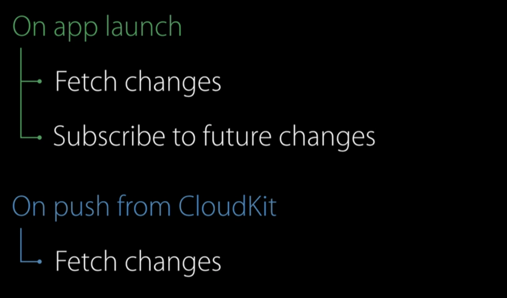
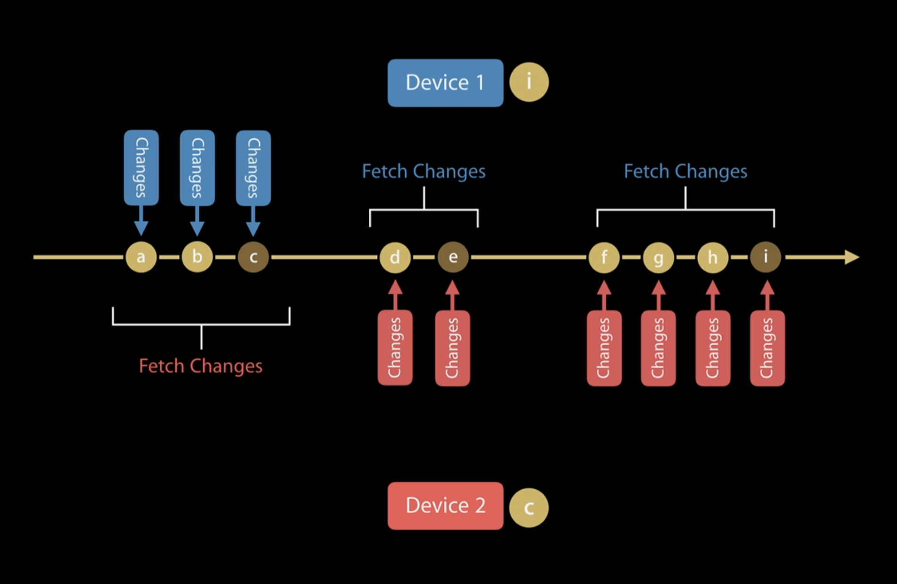
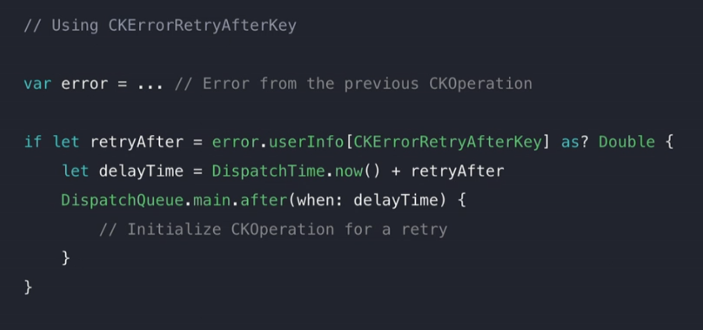

# 2016 - CloudKit Best Practice

[CloudKit Best Practices - WWDC 2016 - Videos - Apple Developer](https://developer.apple.com/videos/play/wwdc2016/231/)

2016 - session 231

이번에 cloud kit을 활용한 개인 앱을 만들고 있는데 대략적인 개념을 알기 위해서 해당 영상을 시청하였다.

# How Apple user CloudKit

Quick refresher

Clodkit Container → app 마다 하나씩 할당이 된다.

Clodkit Container 내부에

- Public  Database

→ 모든 유저가 볼 수 있음

→ default zone 존재

- private

→ 다른 유저는 볼 수 없지만 자신만 모든 플랫폼에 상관 없이 볼 수 있다. 

→ default zone 존재

→ custom zone을 여러개 만들 수 있다.

- shared Database → whats new in cloudkit

→ whats new in cloud kit 에서 해당 데이터베이스에 대한 자료를 확인할 수 있다. 

→ shared zone

각 존에는 record가 있다. - key value

기기에서 클라우드킷에 접속만 하면 된다. 모든 기기에 동일한 데이터를 볼 수 있다. 

클라우드 서버에 푸시하고 풀하는 방식으로 작동된다. 그리고 보통은 받은 정보들을 로컬 캐시에 저장한 다음 변경된 부분만 가져오는 방식을 선택한다.

그렇다면 cloud kit 은 어떻게 작동할까?

- fetch changes

    → 처음에 접속했을 때 어떤 점이 변경되었는지 확인하기 위해 해당 액션을 취함

- subscribe to future change

    → 해당 액션을 취함으로써 앱을 사용하는데 있어서 생기는 변화를 클라우드킷 서버에 푸시한다. 

- 그런 다음 다른 앱에서 fetch change 를 통해 변경점을 확인한다.

### Subscribe to Changes

처음에 실행할 때 server를 subscribe 해야 한다.

앱에서 데이터에 대한 변경이 생긴 경우 이에 대응하기 위해서 서버를 subscribe 한다.

### Listen for Pushes

클라우드 서버에서 변화를 구독하고 있다가. 변화가 발생하는 순간  APNS ( apple push notification service token ) 를 통해서 변화를 다른 기기에 푸시하게 된다. 이를 통해서 다른 기기에서도 변화를 감지할 수 있고 동기화가 가능해지는 것이다. 

그리고 다른 기기에서 변화를 확인할 수 있는 것이다. 그 다음 서버에 해당 토큰을 통해서 업데이트 되었다는 것을 알린다.

### Subscribing to Changes

실제로 코드를 들여다보면 제일 먼저 확인할 것은 해당 정보들이 로컬 캐시가 되어있는지 먼저 확인한다. 

그 다음 id를 통해서 subscription을 만든다. 

그 이후에 notification을 설정해서 어떤 트리거를 통해서 정보를 푸시 할 것인지 설정 해준다.

- Push Config

가장 기본적으로 silent push 를 추천한다고 한다. 

notionfo().shouldSnedContentAvailable = true 로 설정해준다. 이렇게 되면 구독에 대해서 slient push 가 된다.

그리고 유저에게 해당 정보를 받아도 되냐는 프롬프트를 띄워줄 필요가 없다. 

그 다음 application.registerFromRemoteNotifications 를 통해서 해당 노티피케이션을 등록한다.

그 다음 operation 을 통해서 변화를 체크하고 데이터를 저장하면 된다.

CK Operation → NSOperation을 상속 받는다.

### Listen for pushes

백그라운드 에서도 변화를 감지하고 싶다면 background mode 에서 background fetch 그리고 remote notification을 켜놔야 한다.

이렇게 하고 난 뒤에 delegate의 remotenoti 액션에 대해서 정의를 해주면 된다. 

이때 susbscriptionID를 확인해줌으로써 어떤 노티피케이션인지 정확하게 인지하고 있어야 한다.

### Fetch new changes

그리고 변화를 감지하면 된다. 푸시 노티를 받으면 두가지를 확인해야 한다. 첫번째로 어떤 Zone 에 대한 변화점 인지 먼저 확인을 한다. 그리고 두번째로 해당 zone에서 어떤 record 인지 확인을 해야 한다.

변화를 감지할 때 또 다른 중요한 점은 변경이 될 때마다 토큰이 바뀌는데, 모든 토큰을 다른 기기로 보내는 것이 아니라 변화가 일어난 토큰 중 마지막 토큰을 보내는 것이다. 

 

변화에 대해서 확인을 할 때 이전에 받은 데이터에 대한 토큰 값을 파라미터로 넣어줘야 한다. 만약에 처음 해당 액션을 한다면 해당 토큰 값은 nil이 될 것이다.

결국 핵심은 어떤 부분이 변화가 되었는지 정확하게 확인하고 가져올 수 있다는 점이다. 

# CloudKit Best Practices

- automatic authentication
- CKOperation API
- Data modeling
- Error handling

## Automatic Authentication

CloudKit user Record 를 통해서 유저의 로그인 단계를 단순화 시켰다. 따라서 따로 유저에게 어떤 정보를 받을 필요가 없다. 모든 유저가 자동으로 생성이 되므로 user id 만 잘 확인하자.

fetch user record id 만 하면 된다.

## CK Operation API

CKOperation은 NSOperation의 Subclass이다. 따라서 NSOperation의 기능들을 사용할 수 있다. 의존성, QOS, Cancel 등등이 그런 예가 될 것이다.

CKOperation 자체로는 다음과 같은 기능을 갖추고 있다.

- configurability
    - cellular access
    - Fetch partial records
    - Limit number of results
    - Progress reporting
- resource optimization
    - minimize network requests
    - System resources
    - Request quota
    - Discretionary behavior opt-in
- lifetime management

## Data Modeling

### Schema Redundancies (정리해고)

고화질 이미지를 저장한다고 하자. 사용자에게 그리드 형식의 셀로 보여 준다고 할  때 보통 해당 이미지를 uiiimageview에 적용하는 것이 아니라 thumbnail 형식으로 이미지를 만들어 이를 보여줄 것이다.

이때 thumbnail 을 얻는 가장 간단한 방법은 image 그리고 thumbnail 프로퍼티를 통해서 값을 가지고 있는 것이다. 

이런 방법도 있지만 query 자체에 limit을 걸어서 필요한 부분만 가져오게 된다면 전체의 고화질 이미지를 가져오지 않고도 빠른 속도로 일부분의 이미지를 가져올 수 있기 때문에 굳이 thumbnail 프로퍼티를 통해서 값을 저장하지 않아도 괜찮다는 설명이다.

### CK References

먼저 CKReference 란 record A → record B 를 참조하는 프로퍼티를 말한다. 

3개의 기기에서 사진을 업로드 한다고 하자. 이때 첫번째 아이폰에서 업로드를 하고난 뒤 두번째 기기에서 업로드를 하려고 하면 record의 상태가 맞지 않아서 에러가 나게 된다.

해당 상태를 완벽하게 해결하기 위해서 도입된 것이 Back pointer이다. 즉 photo 자체에서도 album을 참조하고 있는 것이다. 

### Parent reference

- Set Parent references if your app supports sharing

CK Share를 설정함으로써 해당 hiararchy 전체를 공유할 수 있다. 

## Error Handling

크게 fatal error, try again after some times 두가지 에러가 대표적이고 해당 에러를 처리하는 방식은 굉장히 다르다.

### fatal error

- internalError
- serverRejectRequest
- invalidArguments
- permissionFailure

해당 경우에는 operation 이 재시도 되어서는 안된다. 

### try again after ~ ( retry cases )

- zoneBusy
- serviceUnavaliable
- requestRateLimited

해당 경우에는 에러 내부에 userInfo dictionay의 CKErrorRetryAfterKey를 통해서  확인해야 한다.

이후에 동일한 요청을 보내야 한다. 

### etc

이러한 상황 이외에도 서버에 보내기 전에 에러가 나는 경우가 있다. 해당 영상에서는 두가지 메인 케이스를 고려해서 알려주었다.

- device offline
    - networkUnavailable이 발생한다.
    - 해당 경우에는 SCNetworkReachability 를 monitor 함으로써 online이 되는 경우 액션을 보내도록 하자
- Account unavailable
    - notAuthenticated
    - 해당 경우에는 CKContainer 내부에 있는 accountStatus 메서드를 통해서 확인하고 난 뒤 액션을 취하면 된다.