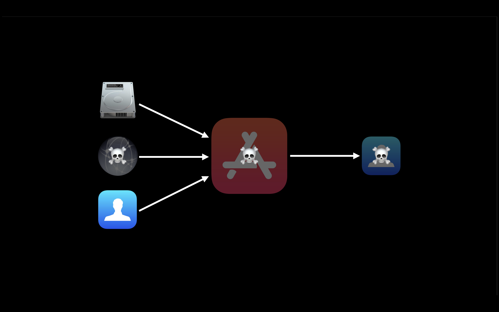
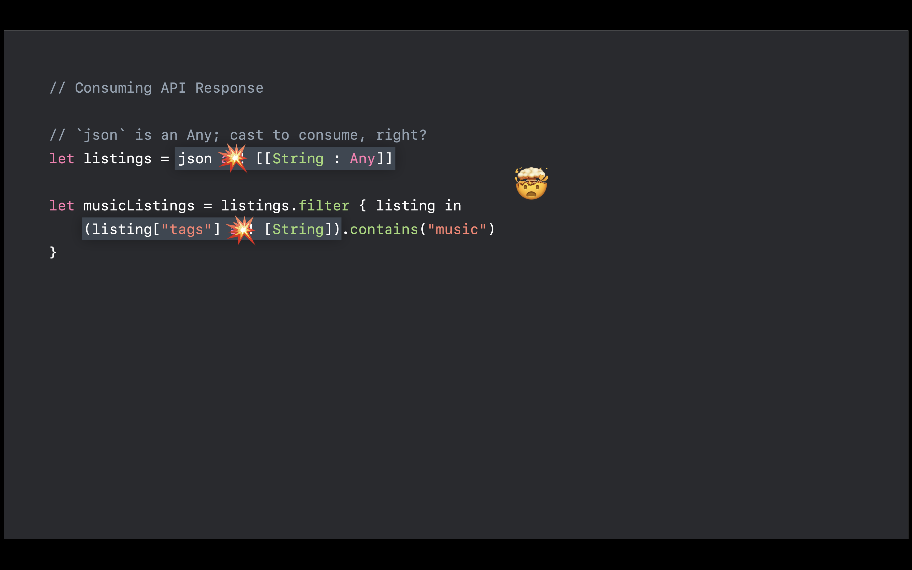

# 2018 - Data you can trust

[Data You Can Trust - WWDC 2018 - Videos - Apple Developer](https://developer.apple.com/videos/play/wwdc2018/222/)

wwdc 2018 - Session 222

대부분의 앱이 데이터를 받아 표현하는 것을 중요시 생각하고 이런 데이터를 어떻게 처리하면 데이터를 믿을 수 있다고 말할 수 있는지 궁금해서 영상을 시청하였다.

어떠한 이유로 인해서 데이터가 제대로 나타나지 않는 경우 사용자에게 안 좋은 경험을 줄 수 있기 때문에 개발을 할 때 온전한 데이터가 들어오는지 확인해야 할 필요가 있다.

## Modeling Data

따라서 data flow 를 이해하고, 각 flow 마다 validation을 통해서 온전하게 믿을 수 있는 데이터로 만들자

먼저 간단하게 데이터가 어떻게 추상화 되는지 확인 해보자.

1. 처음에 들어오는 데이터는 Raw Data이다.
2. 그 다음 우리는 특정 format을 통해서 보기 쉬운 형태로 만들어준다. 이를 formatted data라고 하고 json 형식이 대표적이다.
3. 이후 형식이 갖춰진 데이터를 우리가 사용할 수 있도록 primitive data로 변환한다.
4. 마지막으로 우리가 더욱 편하게 사용할 수 있도록 structed data로 변환하고 이를 사용한다.

연쇄적으로 일어나기 때문에 각 플로우마다 validation이 들어간다면 우리가 원하는 믿을 수 있는 데이터를 사용할 수 있는 것이다.

Formatted data로 변환하는 것은 우리가 크게 관여할 부분이 없기 때문에 영상에서는 Raw - Primitive - Structed 의 flow를 설명한다.

## Raw Data

Raw Data는 Strings of byte 이며 사실 이 자체로는 큰 의미가 없다. 이를 다음 단계로 온전하게 전달하기 위해서는 어떻게 해야 할까?

1. Length
2. Checksum

첫번째로 data의 length로 판단할 수 있을 것이다. 데이터의 크기를 미리 알고 length 가 다르면 제대로 데이터가 오지 않았다고 판단할 수 있다. 하지만 데이터의 크기를 미리 알지 못하는 경우에는 판단하기 어렵다는 단점이 있다.

두번째는 Checksum 이다. 내부에 어떤 데이터가 있는지 모르더라도 어떻게 생겼는지 대략적으로 확인하는 것이다. 내부의 데이터를 해쉬 값으로 변경 시킨 값 인데, checksum을 비교해서 중간에 데이터가 유실된다면 이를 확인할 수 있다. 

## Primitive Data

Raw Data 가 제대로 확인 되었고, serializer 등으로 인해서 Primitive Data 가 도출되었다.  그렇다면 해당 값을 믿어야 할까? 우리가 직접 들여다 보기 전에는 타입이나 값에 대해서 알지 못하기 때문에 쉽게 믿을 수 없다.

따라서 우리는 값을 도출하고 타입을 확인하기 위해서 JsonSerializer 를 사용하게 된다.

json 은 [String: Any ] 타입으로 선언 되어 있고, 이를 위해서 downcasting 이 필요하다. 이런 downcasting 을 하는 방식중에 as! 는 최대한 지양하도록 하자. 만약 서버에 데이터가 변경된다면 이는 fatalerror를 내고 사용자에게 좋지 않은 경험을 준다. 

영상에서는 Validate First, Execute Later 를 권유 한다. 데이터가 제대로 들어오지 않았을 때 차라리 빈 값으로 처리를 하거나 error를 던지는 것이다.

들어온 모든 데이터에 대해서 예상한 대로 들어오는 것도 중요하다고 강조하였다. 예를 들어서 연속적인 숫자가 들어와야 하는 데이터에 negative value 가 들어오면 어떻게 될까? 혹은 너무 큰 숫자면? 오버플로우를 발생시킬 수도 있을 것이다.

혹은 URL 을 생각해보자 만약 우리 도메인이 아닌 다른 피싱 앱 도메인이 들어가게 된다면??  Date 의 경우 create 된 것보다 lastupdate 된 것이 더 나중이라면? 

위와 같이 의도와 맞지 않은 경우의 데이터를 믿고 사용하기 위해서 다음과 같이 validate logic을 넣는 것을 추천한다.

## Structured Data

애초에 archive(encoding) 를 할 때 class 를 지정해서 하는데 굳이 decoding을 할 때 type validation을 왜 해야 할까?

Object decoding 에서 만약 class 가 변경된다면?? 이런 경우는 어떻게 생각해야 할까? ( 그렇기 때문에 타입에 대해서 guard 를 건다 )

데이터를 unarchive 할 때 archive 당시에 저장한 타입을 가져와서 데이터를 변환한다. 이는 이상적인 경우이다. 하지만 어떤 이유로 인해서 예상하지 못한 class가 들어온다면 변환하지 못할 것이고 이는 에러를 발생시킨다.

### NSSecureCoding

이런 예상치 못한 데이터 타입에 대응하기 위해서 나온 프로토콜이 NSSecureCoding Protocol 이다. 해당 프로토콜의 역할은 다음과 같다.

- Prevent arbitrary code execution
- Establish expectations in code
- Provide explicit way to validate types

flow 자체에 class type validation이 들어가서 우리가 안전하게 타입을 확인하고 사용할 수가 있다.

NS 가 주는 decoding failures 의 몇가지 실패에 대해서 살펴보자.

- Secure coding violation
    - NSSecureCoding 을 하게 되는 경우 나타날 수 있는 에러로써 타입이 맞지 않는 경우를 말한다.
- Type mismatch
    - 디코딩 할때 프로퍼티의 타입이 맞지 않는 경우를 말한다.
- Archive corruption
    - 아카이브 자체가 너무 손상되어서 Unarchiver 의 형식을 제대로 따르지 않고 아무것도 할수 없는 상태를 말한다.

기본적으로 디코드가 실패하게 되면 fatal error 이기 때문에 앱을 죽일 수 있다. 따라서 이를 실패하도록 제대로 진행되게 해야 한다. 이를 위해서 아래와 같은 방식을 추천한다.

1.  decodeObject(forKey:) 대신에 decodeObject(of:forKey:)를 사용하자 
2. 실패에 대해서 명확하게 해서 의미 있도록 만들자
3. 단순히 타입만 확인하고 끝내는 것이 아니라 프로퍼티의 값 또한 validate 하자

## Codable

요즘에는 archiver를 직접적으로 사용하기 보다는 codable 을 많이 쓰고 있다. 이때도 예외가 아니다. init을 override 해서 각 프로퍼티에 대해서 validateion을 처리 해 준다면 우리가 믿을 수 있는 데이터가 도출 될 것이다.

