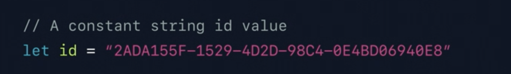
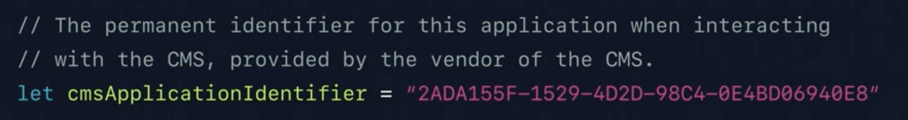

# 2019 - Great Developer habits

[Great Developer Habits - WWDC 2019 - Videos - Apple Developer](https://developer.apple.com/videos/play/wwdc2019/239/)

좋은 개발자가 되기 위해서 어떤 습관을 갖는 것이 좋을지, 애플의 개발자는 어떤 생각을 하는지 궁금하여 해당 영상을 시청하였다.

# Great Developer habits

개발자들은 앱을 만드는 것 뿐만이 아닌, 숨겨져 있는 detail 에 집중해야 하고 이를 습관화 해야 한다. 아래와 같은 주제들을 말한다. 

- organize
- track
- document
- test
- analyze
- evaluate
- decouple
- manage

## Organize

작업대가 정리되어 있지 않은 상태에서 무언가를 만들려고 한다면, 물건을 뒤적거리고 사고가 일어날 가능성이 높다.  앱을 만드는 것도 마찬가지이다. Xcode 내부에서도 적절한 위치에 잘 나누어진 파일을 위치시키는 것은 앱을 만드는데 큰 도움을 줄 것이다. 따라서 그룹을 적절하게 활용하는 것이 자신뿐만 아니라 다른 개발자들이 코드를 봤을 때에도 큰 도움이 된다.

- storyboard

하나의 스토리 보드에 모든 뷰컨트롤러를 넣는 것은 좋지 않다. 스토리보드 레퍼런스를 이용해서 각 섹션을 나누고 이를 연결하자. 이를 통해서 팀이 많아 지더라도 충돌이 일어날 가능성이 현저하게 줄어들 것이다. 

- Modern

xcode 버전 혹은 swift 버전을 항상 최신으로 맞추자.  업데이트 했을 당시에 크리티컬한 이슈가 없다면 project 파일을 최신버전으로 업데이트 해 주는 것이 좋다.  xcode build system 을 이용해서 project setting 을 공유할 수 있다.

또한 사용하지 않는 코드들을 단지 주석을 통해서 혹은 나중에 필요할 것이라고 남겨두지 말자. 어차피 다시 쓸 일이 거의 없으며 필요하더라도 기록으로 남겨져 있고, 결국에는 나중에 다시 만드는 것이 훨씬 낫다. 

warnning을 남겨두지 말자. 0 warnning 을 만들고 이를 개인과 팀 단위에서 유지하려고 노력하자.  사실 크리티컬 하지 않기 때문에 무시한다면, 다음에 warnning 이 나타나도 무시하기 마련이다. 그로 인한 사이드 이펙트는 아무도 예측할 수 없다.

### Summary

프로젝트 파일을 잘 정리하고 깔끔하게 하자 길게 봤을 때 앱의 성공을 좌지우지 할 것이다.

- Functional organization with Groups
- Mirror project structure and file structure
- Break apart large storyboards
- Modernize your project file
- Throw away code scraps
- Address the root cause of warnings

## Track

프로젝트를 시작할 때 항상 해야 하는 것이 소스를 컨트롤 하는 것이다. github 등을 사용하여 소스를 트래킹 하는 것을 말한다. 이때 사용하는 몇가지 팁을 말해 주자면 아래와 같다.

1. commit small
    - 기능이 동작하고 끝나는 선에서 커밋을 작게 하자. 나중에 잘못을 추적할 때 큰 도움이 될 것이다.
2. write useful commit message
    - 나중에 돌아 봤을 때 커밋 메시지가 제대로 안 되어 있다면, 당시의 상황과 코드를 추적하기 힘들 것이다.

### Summary

- User source control
- Keep commits small and isolated
- Write useful commit messages
- Utilize branches for bugs and feature work

## Document

발표자가 말하는 좋은 개발자란 주석과 문서 작성에 공을 들이는 사람이라고 한다. 이를 통해서 코드를 명확하게 이해할 수 있으며, 협업하기 굉장히 쉬워진다. 주석과 문서를 통해서 팀에 도움이 될 수 있으며, 자기 자신에게 큰 도움이 될 수 있다.

"I don't need comments, my code is self-documenting" 이와 같은 말이 있지만, 왜 작성했는지 어떤 상황에 사용되는지 등 설명은 필요할 수 있다. ( 물론 코드는 해당 문구를 따르도록 명확해야 한다. ) 좋은 개발자들은 코드 자체가 깔끔하며, 추후에 다른 개발자 혹은 자신이 봤을 때 조금 더 명확하게 이해할 수 있도록 도움을 준다.

좋은 코멘트란 어떻게 동작 하는지 단순하게 적는 것이 아니라, 어쩌다가 해당 위치에 해당 코드가 나타나게 되었는지를 명확하게 설명하는 것이다.

코드를 아무리 잘 나누고 작성했다고 하더라도, 나중에 볼때는 결국 해당 코드에 대해서 다시 보고 생각하는 시간이 필요하기 마련이다. 자기 자신이 작성했다면 그나마 낫겠지만 다른 사람이 봤을 때에는 더 많은 시간이 할애 될 것이다.

- document tip

option + command + / 를 통해서 문서를 간단하게 만들 수 있으며, 코드를 보면서 option + click 을 한 경우 작성된 문서를 쉽게 확인할 수 있다. 

### Summary

- Comments are critical for future understanding
- Good comments provide background and reasoning
- User descriptive variable and constant names
- Include docmentation

## Test

Unit Test는 단순히 지금의 동작을 테스트 하는 것이 아니다. 테스트가 빛을 발하는 순간은 나중에 해당 구조가 변경이 되었을 때 우리가 확인하지 못한 케이스를 잡아내는 순간이다. 우리의 코드는 계속해서 발전한다. 이때 모든 케이스를 충분히 테스트 할 시간이 없기 때문에 유닛테스트를 작성하는 것이다. 

### Summary

- write unit tests
- Run unit tests before committing code
- Build a foundation for continuous integration

## Analyze

개발 도구를 통해서 Network를 제한해보자. 생각 치도 못한 부분에서 많은 에러와 버그를 발견할 수 있을 것이다.  

또한 Build Setting에 diagnostics를 들어 가보면 다음과 같은 옵션들을 발견할 수 있으며, 적절하게 활용한다면 앱의 비정상적인 동작을 확인하는 데 도움을 받을 수 있을 것이다.

- Address Sanitizer
    - 메모리 충돌 , 버퍼 오버플로우 체크
- Thread Sanitizer
    - data race 체크
- Undefined Behanvior Sanitizer
    - 예상치 못한 행동들을 확인한다. ( divided by zero 등등 )
- Main Thread Checker
    - 백그라운드에서 UI 를 사용하는 경우를 확인한다.

추가로 debug gauge를 확인하자. debug navigator 에서 확인할 수 있다. 이를 통해서 비 정상적인 네트워크 등을 파악하자. 마찬가지로 Instrument 를 통해서 다양한 문제점들을 확인할 수 있다. 

### Summary

- Simulate poor networks with Network Link Conditioner
- Use sanitizers and checkers
- Measure performance and efficiency with Debug Gauges
- Investigate issues with Instruments

## Evaluate

Code review는 굉장히 중요하다. 회사에서 안된다면 외부 커뮤니티를 통해서라도 다른 개발자의 인사이트를 얻으려고 노력하자

### Summary

- Include code review as part of your practice
- Understand each line
- Build it
- Run tests
- Proofread for style, spelling, and syntax

## Decouple

- Determine functional segments and break them out
- Scale your work across multiple apps
- Improve efficiency with extensions
- Share your efforts with the broader community
- Documentation is critical

## Manage

package 등 다른 사람이 만들어놓은 라이브러리를 사용하는 것이 좋은 일이지만, 그 안에 무엇이 있으며 어떤 이펙트가 나타나는지 아는 것은 굉장히 중요하다.  또한 프레임워크 자체가 망가지거나 사라지는 이런 경우를 대비한 계획을 세우는 것도 중요하다.

### Summary

- Use community and open source projects responsibly
- Understand dependuncies thoroughy
- Ensure that privacy is respected
- Have a plan if a dependency goes away or is no longer maintained