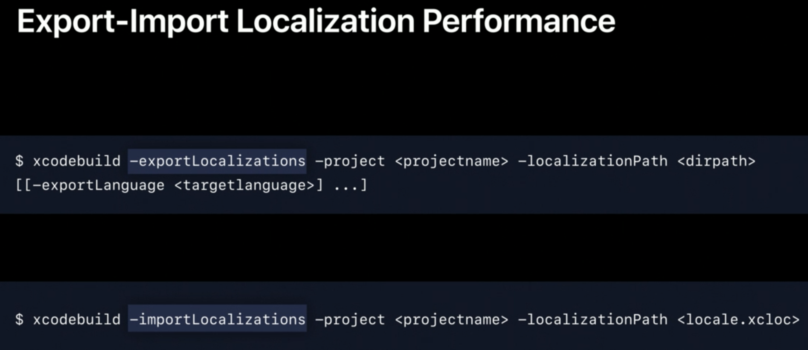

# Great Localized Experieces

[Creating Great Localized Experiences with Xcode 11 - WWDC 2019 - Videos - Apple Developer](https://developer.apple.com/videos/play/wwdc2019/403/)

# **WWDC 2019 - 403 session**

### New localization features

이제는 설정에서 각 앱에 대한 언어의 설정을 따로 할 수 있다.

먼저 Localization을 하기 전에 알아 둘 점은 프로그래머가 직접 언어를 변경할 수 없으며, 언어가 맞지 않으면 사용자에게 설정을 들어가도록 유도하여 직접 언어 설정을 시켜야 한다는 점이다.

앱의 언어를 변경하게 되면 앱이 다시 실행된다. 이때 사용자의 편의를 위해서 사용자가 실행 했던 ViewController를 다시 복원하도록 할 수 있다. 이 과정은 restoration이라고 부르고 먼저 각 ViewController마다 restorationId를 설정 해주어야 한다. 그 다음 아래와 같이 restoration을 가능하게 함으로써 언어가 바뀌면서 앱이 재실행 되더라도 사용자가 보던 화면을 그대로 보여주면서 앱의 언어 전환을 부드럽게 할 수 있다. 

iOS 13 부터는 sceneDelegate를 사용할 수 있으며, scene restoration을 활용할 수 있으니 이를 활용해도 좋다.

또한 Locale.preferredLanguages 를 통해서 유저가 사용하는 langeuage list 를 가져올 수 있다. 만약 서버에서 여러 언어의 데이터를 제공하는 경우 해당 리스트에서 사용 가능한 언어를 선택하여 데이터를 보여줄 수 있을 것이다. 

### Localization workflow improvements

10.3 에 비해서 performance 측면에서 15 배나 빨라졌다는 점을 강조했다. 이제는 직접 파일을 만들지 않아도 된다. 아래와 같이 실행하면 설정한 언어에 따라서 localization에 필요한 파일들을 만들어준다.

언어에 대한 분류 뿐만 아니라 여러 디바이스에서 텍스트를 다르게 표현해야 하는 경우가 있을 수 있다. 이번에 추가된 NSStringDeviceSpecificRuleType 을 통해서 device 에 맞춰서 다르게 표현할 수 있다는 사실을 알아두면 좋다. 가능한 device는 appletv, applewatch, ipad, iphone, ipod, mac 등등 거의 모든 디바이스를 타입에 맞출 수 있다. 

이미지와 같은 경우에도 기존에는 사용하는 언어에 맞춰서 이미지 파일을 각각 만들어 줘야 했다 하지만 이제는 asset에서 바로 관리를 할 수 있다. 오른쪽 하단에 localization 버튼을 누르면 각 언어에 대한 이미지를 설정할 수 있도록 화면이 준비된다. SFSystemSymbols 및 Custom Symbols 또한 동일한 방식으로 localization을 사용할 수 있으니 이를 참고하면 된다.

어떤 프로젝트의 localization을 그대로 다른 프로젝트에 쓰고 싶거나 가져오고 싶은 경우가 있을 것이다. 이 경우에는 project navigator에 들어간 다음 editor → export for localization을 하게 되면 해당 각 언어에 대한 xcloc 폴더가 생성된다. 이를 활용하면 프로젝트 간 localization이 쉬워질 것이다.

localization 을 하면 할수록 수 많은 디바이스와 언어를 다르게 해서 실행한 다음 확인해야 하는 문제점이 생긴다. 이제는 TestPlans 를 통해서 이런 고민을 할 필요가 없어졌다. 해당 plan 을 통해서 어떤 언어로 실행할 것인지 혹은 어떤 디바이스로 실행할 것인지 설정할 수 있으며, 다양한 설정을 갖추고 있다. 예를 들어서 3개의 언어를 실행하겠다고 하면 앱이 3번 실행 되면서 확인할 수 있다. 또한 스크린샷 기능을 갖추고 있어 테스트를 돌리고 나중에 한꺼번에 확인할 수 있는 기능이 있다는 점을 알아 두자. UI Test 를 통해서 가능하다.

TestPlan 에 대해서 조금 더 자세하게 알고 싶다면 다음 영상을 참고하자 [WWDC - Testing In Xcode](https://developer.apple.com/videos/play/wwdc2019/413/)