# 2019 - Improving Battery Life and Performance

[Improving Battery Life and Performance - WWDC 2019 - Videos - Apple Developer](https://developer.apple.com/videos/play/wwdc2019/417/)

앱이 커지고 기능이 많아 질수록 배터리를 빠르게 소모하기 마련이다. 이때 어떤 측면들이 배터리를 소모시키는지 알아보고 싶었고, 이를 어떻게 개선하는지 알아보기 위해서 해당 영상을 채택했다.

# Tools overview

## The Development Process

개발은 여러 단계로 나누어져 진행된다. 개발과 테스팅, 베타 릴리즈 그리고 공식 릴리즈이다. 이때 Xcode 11 과 iOS 13 이전에는 다음과 같은 방식으로 퍼포먼스를 측정했다.

1. Developmenting and testing 

    → Xcode → instrumant, profile tools ...

2. Beta

    → developer setting

3. Public Release

    → crash, cpu energy report 

하지만 각 스텝 사이에 퍼포먼스를 측정하는 방식이 다르고 이러한 다름을 없애고 싶었다. 이를 위해서 Metric을 개발하였다.

## Metric

어떻게 하면 battery 효율을 측정할 수 있을까에 대한 고민을 하기 시작했다. 또한 어떤 기능을 개발하여 비교하고 싶을 때 예를 들어 feature A → B 로 가면서 효율이 얼마나 변할지 쉽게 측정하고 싶었다.

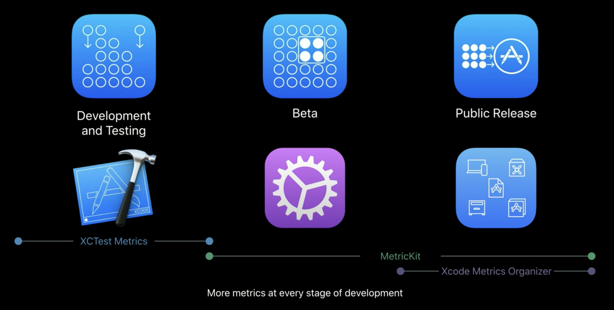

그리고 Xcode 11 , iOS 13 부터 새로운 기능인 Metric을 사용할 수 있다.

- XCTest Metrics - xcode 11
    - performance of measure metrics
- MetricKit
    - 퍼포먼스 측정 프레임워크
- Xcode Metrics Organizer
    - 배터리 효율, 퍼포먼스 그리고 I/O Metrics in Xcode 에 대한 정보를 측정한다.

따라서 각 스텝에서 위와 같이 툴을 활용할 수 있다.

# Metrics overview

Metrics 에서는 두가지 키를 중점으로 효율을 측정한다.

1. Battery
2. Performance 

### Bettary Metrics

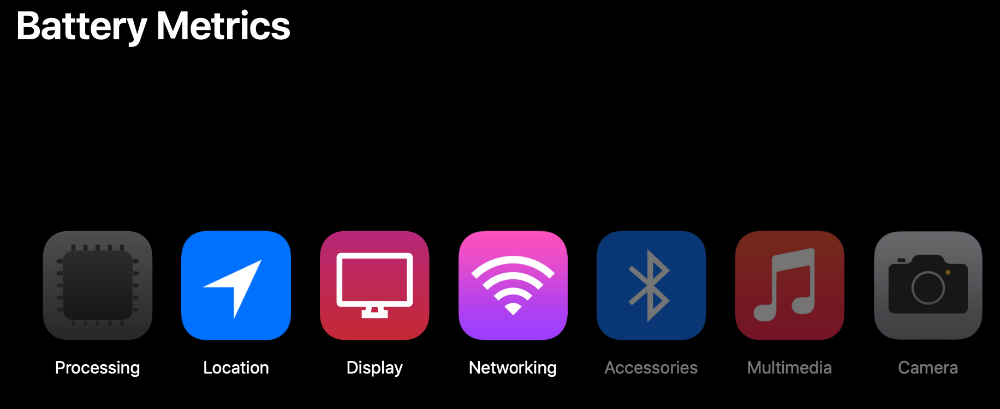

Battery Metrics 는 다음과 같은 하위 카테고리를 분류해 값을 측정하고 있다.

- Processing Metrics

    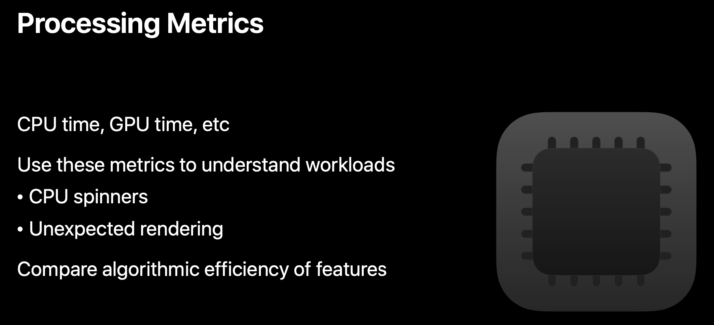

    - 위와 같이 측정할 수 있으며 위에서 말한 feature A 의 알고리즘과 feature B 알고리즘 중에서 어떤 알고리즘이 배터리에 대해서 효율적 인지 측정할 수 있다.
- Location Metrics

    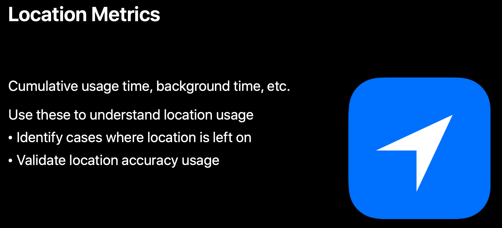

    - 특히 위치의 경우 백그라운드 스레드를 지속적으로 사용하는 경우가 많이 때문에 주의 깊게 봐야 한다.
- Display Metrics

    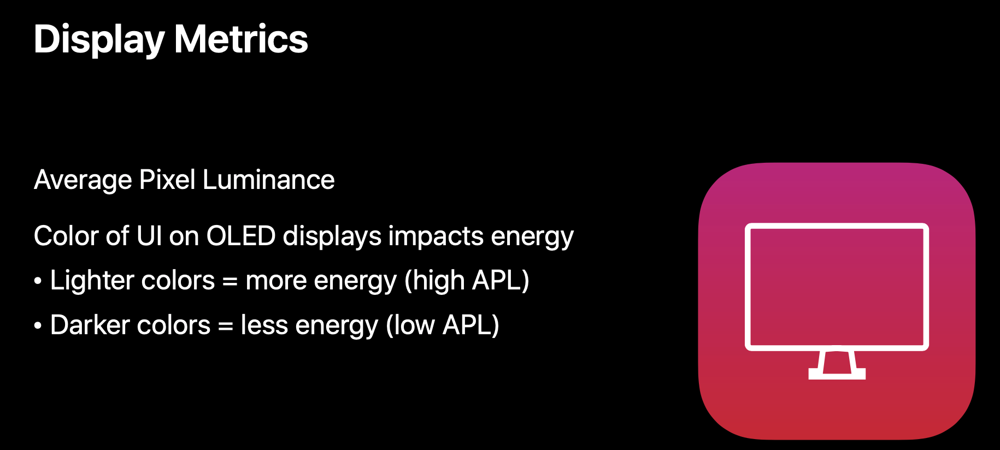

    - 픽셀 단위로 측정하여 성능을 본다.
    - 컬러 값에 따라서 배터리 사용량이 다르다는 것도 알아두자
- Networking Metrics

    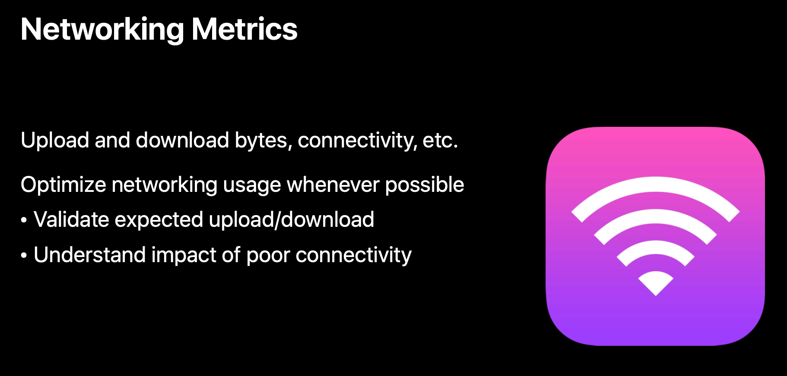

    - 빈번하게 일어나고 많은 에너지를 소모 하므로 최소화 할 수 있어야 한다.

### Performance Metrics

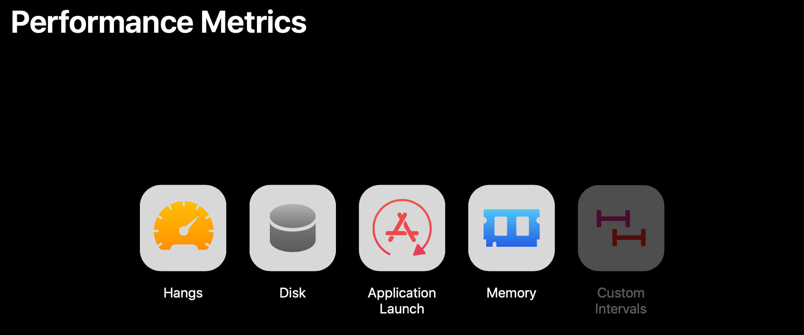

Performance Metrics 는 다음과 같은 카테고리로 측정하고 있다.

- Hang Metrics

    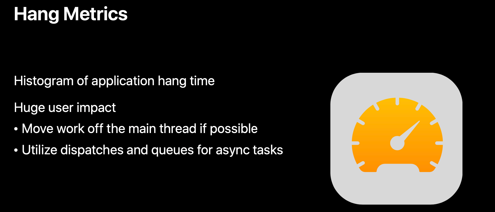

    - 사용성에 있어서 굉장히 중요하다. 유저가 사용하다가 앱이 멈추는 것은 굉장히 좋지 않은 경험이기 때문이다.
- Disk Metrics

    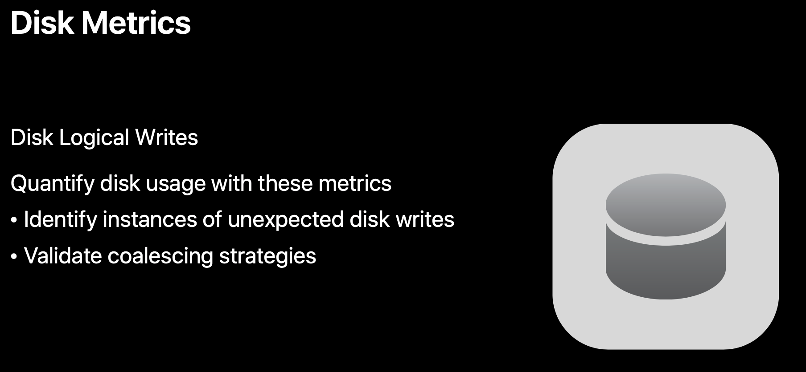

- Application Launch Metrics

    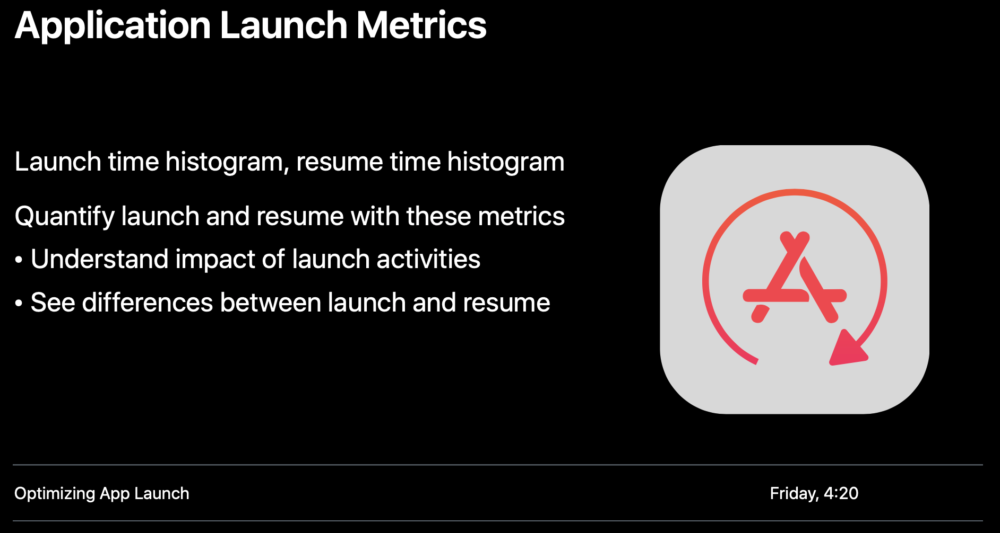

    - Launch Time 을 줄이는 것은 사용성에 있어서 굉장히 중요하다.
    - 해당 주제에 대해서는 또 다른 WWDC 영상이 있으니 같이 보는 것이 좋다.
    - WWDC → [Optimizing App Launch](https://developer.apple.com/videos/play/wwdc2019/423/)
- Memory Metrics

    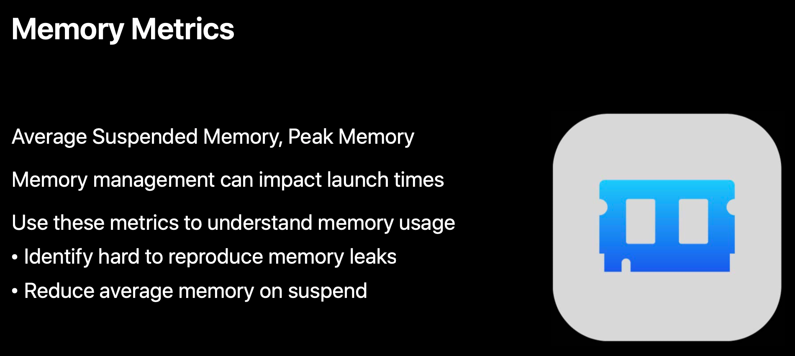

    - 특히 갑자기 메모리 수치가 높아지는 부분을 잘 확인 해보자, 이는 메모리 누수일 가능성이 굉장히 높다.

# Deep dives and Demos

## Measuring App Impact during Development and Testing

XCTest 에서 measure() 통해서 퍼포먼스를 측정할 수 있었다. 그리고 이제는 metrics prameters 를 추가함으로써 다양한 측면에서 효율을 측정할 수 있다.

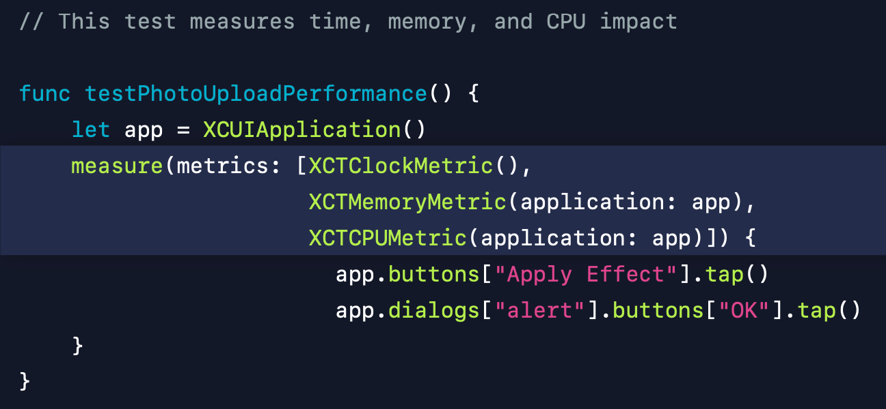

또한 application launch 에 대한 퍼포먼스도 측정할 수 있다. 

Demo 

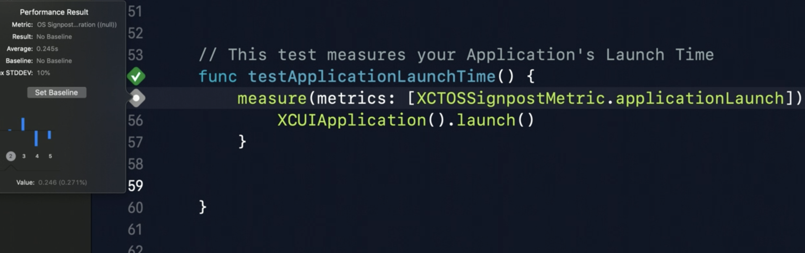

application launch 에 대한 퍼포먼스 측정이 가능하다. 그리고 baseline 을 잡을 수 있다. XCTest 에서 applicatioLaunch metrics 를 추가하고 실행시키면 코드의 왼쪽에 회색 사각형이 나타난다.

해당 사각형을 누르게 되면 실행에 대한 퍼포먼스를 확인할 수 있고, baseline 을 설정할 수 있다. 그리고 설정한 base line 보다 낮은 퍼포먼스를 가지게 되면 테스트가 실패한다. 

만약에 실패하게 되면 instrument 의 time profiler 를 통해서 확인하면 조금 더 쉽게 파악할 수 있을 것이다. 데모에서는 테스트를 위해서 app 의 런칭시 database update 를 진행하였고 해당 테스크를 background queue 로 넘기면서 퍼포먼스가 향상 되었다.

- 놀라운 팁을 하나 발견했는데 오른쪽 상단에 + 버튼을 통해서 지정된 블럭에 자주 쓰는 템플릿을 바로 묶을 수 있다는 점이다.

    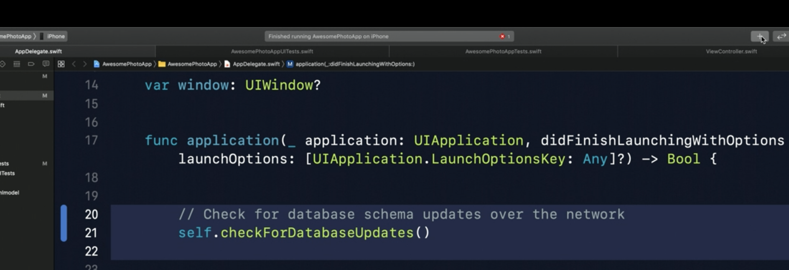

    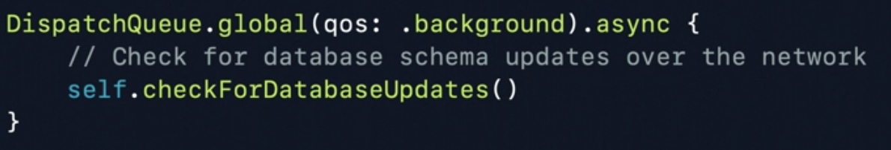

- measure를 할 때 측정을 원하는 Metrics를 같이 넘긴다면 해당 기능을 여러 측면에서 조금 더 자세하게 볼 수 있을 것이다.

    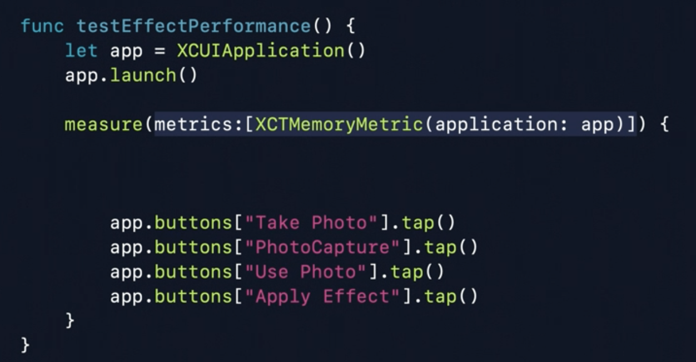

- A/B Test

    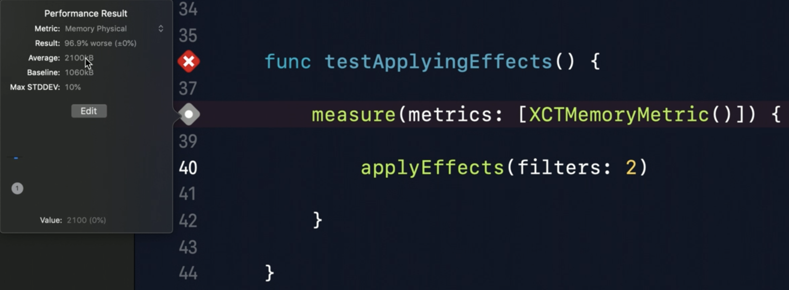

    - 아까 XCTMemoryMetric 을 통해서 baseline을 잡을 수 있다고 했다.
    - 이를 통한 A/B Test를 강조 했는데 위의 사진을 보자 사진에서는 applyEffects(filters: 2) 이지만 이전에 applyEffects(filters: 1) 을 통해서 baseline을 잡았다. 그리고 비교했을 때 applyEffects(filters: 1) 의 효율이 조금 더 나은 것으로 확인할 수 있다.
- Custom Metrics

    기존에 주어진 Metrics 말고도 Custom Metrics를 만들 수 있으니 문서를 확인해보면 된다. 

## Measuring App Impact in the Field

### Metric Kit

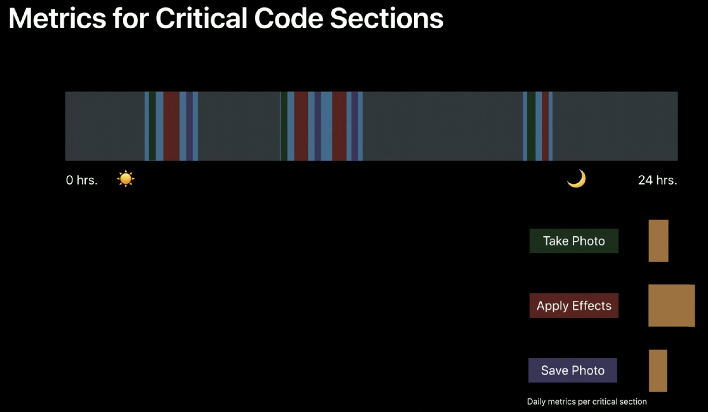

Daily로 퍼포먼스를 측정한다. 이때 전체적인 부분을 보는 것이 아니라 각 기능별로 퍼포먼스를 따로 확인할 수 있는 장점이 있다.

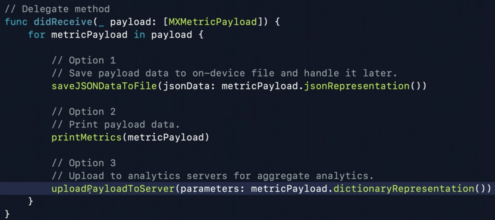

MXMetricManagerSubscriber 를 채택하고 delegate Method인 didReceive 에서 여러 옵션들을 설정할 수 있다. 기본 설정을 마치고 Xcode 에서 앱을 실행한 뒤 Debug → Simulate MetricKit Playloads 를 누르면 playload에 대한 값들을 확인할 수 있다.

### mxSignposts

데모에서는 자세하게 설명하지 않았다. 특정 구간에 대해서 퍼포먼스를 측정할 수 있다고 하는데 나중에 문서를 통해서 살펴보자

## Introducing Xcode Metrics Organizer

사용자의 기기에서 어떤 퍼포먼스를 갖추고 있는지 확인할 수 있다. xcode 11 부터 사용이 가능하며 앱 자체를 바꿀 필요가 없다. 사용자의 기기에서 퍼포먼스가 측정되어 서버로 전송되고 이를 프로그래머가 확인하는 방식이다. 

애플의 서버에서 해당 정보들을 취합하고 확인한 뒤 Metrics Organizer 에서 이를 확인할 수 있다. 따로 프로그래머가 신경 쓸 필요가 없으며 바로 가용이 가능하다는 큰 장점이 있다.

이를 확인하기 위해서 window → Organizer를 눌러보자 Metrics 탭이 새로 생긴 것을 확인할 수 있다. 기기, 버전 주제별로 퍼포먼스가 측정 되어 있고 이를 확인할 수 있다.

# Summary

Three new tools

- XCTest Metrics
- MetricKit
- Xcode Metric Organizer

Tools can quantify the battery and performance impact of your app

Matrics can help you make decisions about your app

# Conclusion

굉장히 유용한 세션이다. 내가 생각했던 것보다 퍼포먼스에 대한 측정에 대해서 애플이 얼마나 노력을 들였는지 알 수 있었으며, 이를 이제 서야 확인 했다는 것에 반성하게 되었다.

생각보다 쉽게 앱의 퍼포먼스를 확인할 수 있었고, 여러 측면에서 이를 비교할 수 있으며 확인할 수 있다는 것에 놀라웠다. 특히 앱의 퍼포먼스 측면에서 수치를 확인하기 쉬웠고, 사용하면서 나중에 발표를 하게 되거나 자료를 준비할 때 유용하게 활용할 수 있을 것 같다.