# 2019 - LLDB: Beyond po

[LLDB: Beyond "po" - WWDC 2019](https://developer.apple.com/videos/play/wwdc2019/429/)

보통 런타임시 에러를 잡기 위해서 debugger 에서 po 를 많이 쓰고는 했다. 그리고 해당 커맨드가 굉장히 유용하다고 느꼈다. 이 외에도 어떤 커맨드가 있으며 어떤 동작을 하는지 궁금해서 해당 영상을 보게 되었다.

LLDB 는 debugger 로써 몇가지 명령어를 통해 값을 확인할 수 있다.

## po

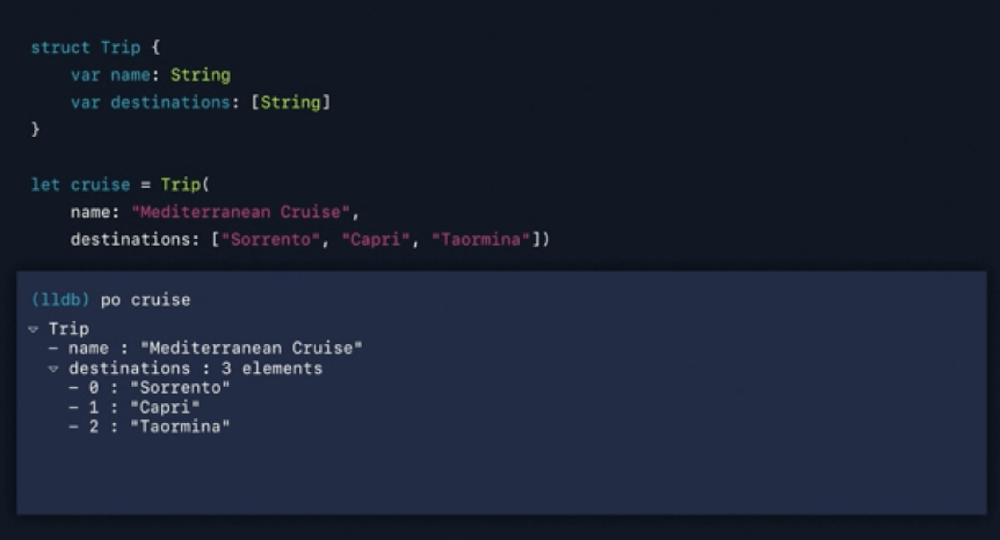

보통 po 를 많이 쓰는데 이에 대해서 한번 알아보자

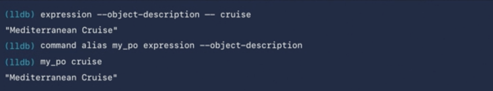

사실상 po 는 expression —object-description의 약어이다. 따라서 약어를 다른 이름으로 설정할 수도 있으며 다른 커멘드를 po 처럼 사용할 수 도 있다. 위의 예제는 po 대신 my_po 라고 지정했으며 expression 을 대치할 수 있는 예제이다.

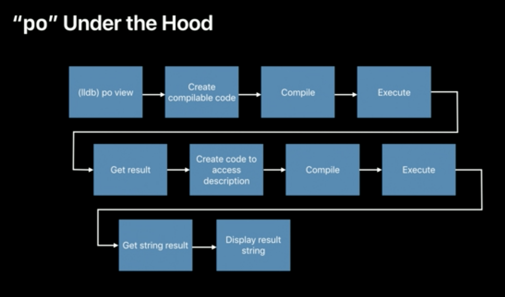

나는 po의 동작이 단순하게 현재 실행되고 있는 코드를 가져와서 이를 실행하는 것이라고 생각했다. 하지만 이는 틀린 생각이다.

po 의 실제 동작은 다음과 같다. 

- po SomeObject 를 입력했다고 하자
- 이때 SomeObject를 가져올 수 있는 complie 가능한 코드를 만들고 이를 컴파일해서 실행한다.
- 해당 값을 가져오게 되면 description에  접근할 수 있는 compile 가능한 코드를 또 만든다.
- 해당 코드를 실행시키고 string result (Object.description) 를 받아서 창에 나타낸다.

## p

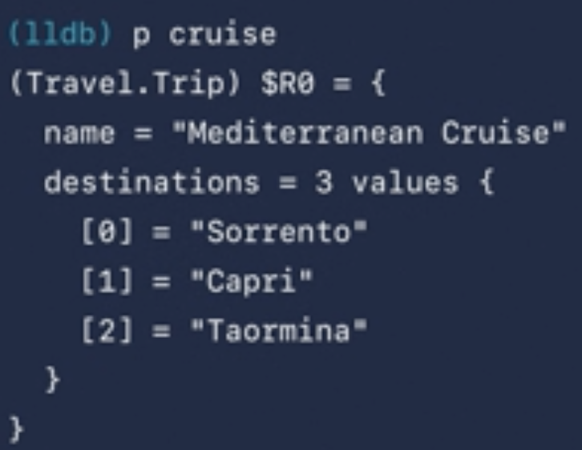

lldb 를 조금 더 사용해 봤다면 po 말고도 p 라는 명령어가 있다는 것을 알고 있을 것이다. 그리고 p 를 통해서 값을 프린트 한다면 po 와 크게 다르지 않다는 것도 알고 있을 것이다. 하지만 위에 $R0 를 주목하자. 이를 lldb에서 기억하고 있는 변수처럼 생각하는 것이다. 따라서 아래와 같은 접근이 가능해지고 조금 더 세분화해서 값을 확인할 수 있는 장점이 있다.

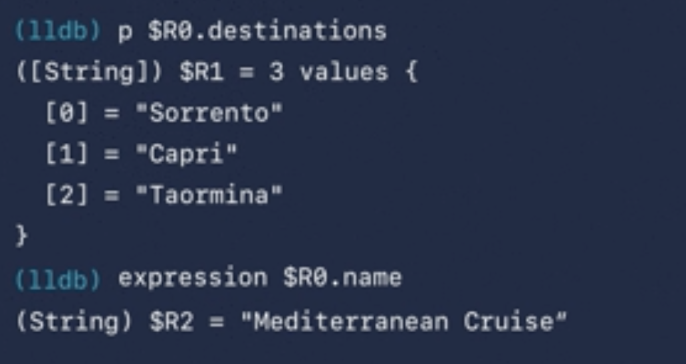

p는 dynamic type resolution을 통해서 가장 적합한 타입을 찾아내서 이를 프린트해준다. 하지만 아직 문제점은 남아 있는데 적합한 타입으로 캐스팅된다는 것이 아니라는 점이다. 따라서 아래와 같은 강제 캐스팅을 통해서 값을 확인해야 한다는 아쉬움이 있다.

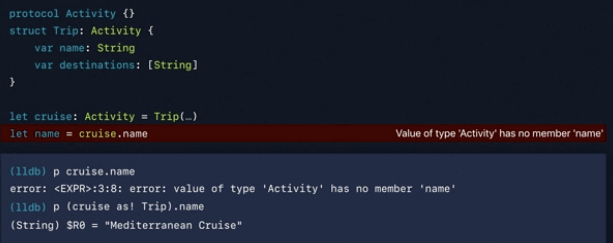

그렇다면 p의 동작 방식은 어떻게 될까?

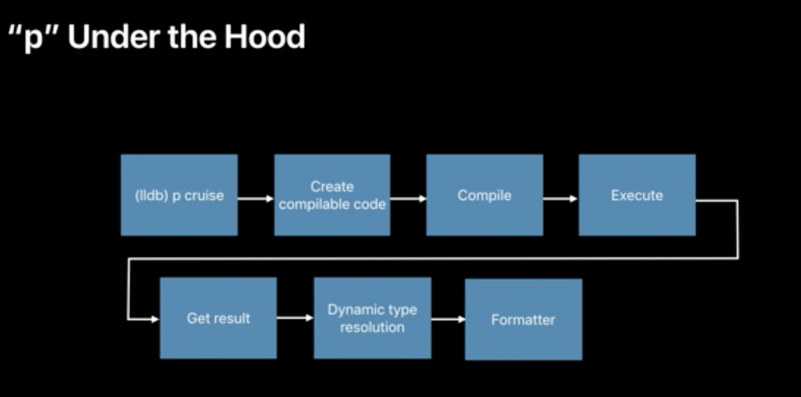

- p SomeObject를 입력했다고 하자
- po 와 동일하게 SomeObject를 가져올 수 있는 컴파일 가능한 코드를 만들고 결과를 가져온다.
- 그 다음 Dynamic type resolution을 통해서 값을 프린트한다.

    → 현재 상황에 맞춰서 가장 적합한 타입을 나타내는 것을 dynamic type resolution이라고 한다.

- 이후에 formattter를 통해서 값을 변환시킨다.

##### dynamic type?

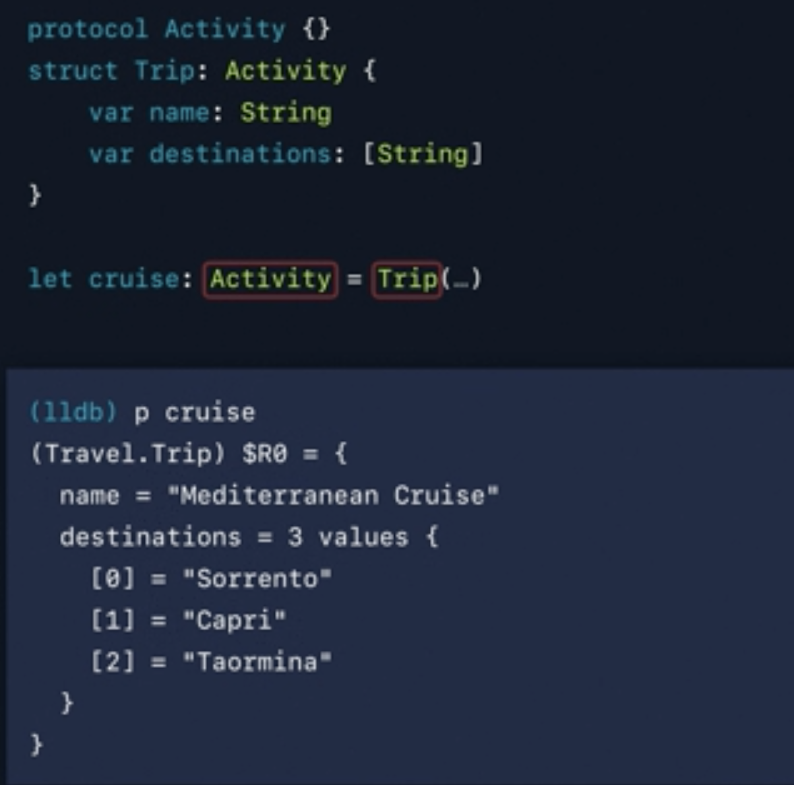

다음과 같은 상황에서 cruise 의 정적 타입은 Activity 이지만 런타임시에 Trip으로 바뀐다. 이런 타입을 다이나믹 타입이라고 한다.

##### formatter ?

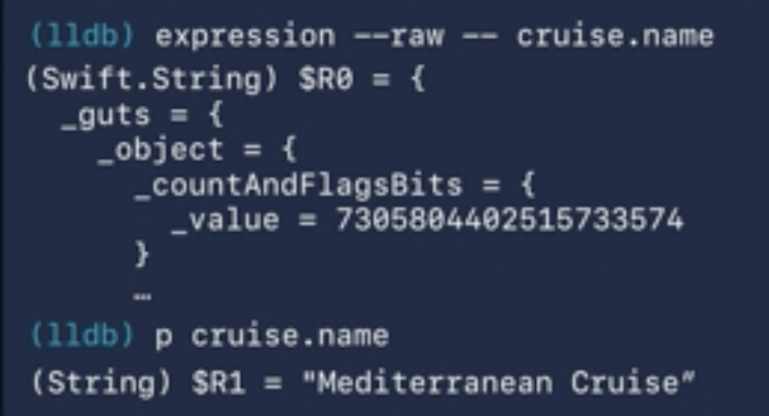

위와 같이 복잡한 변수들을 우리가 보기 쉽게 변환하는 것이다.

## v 

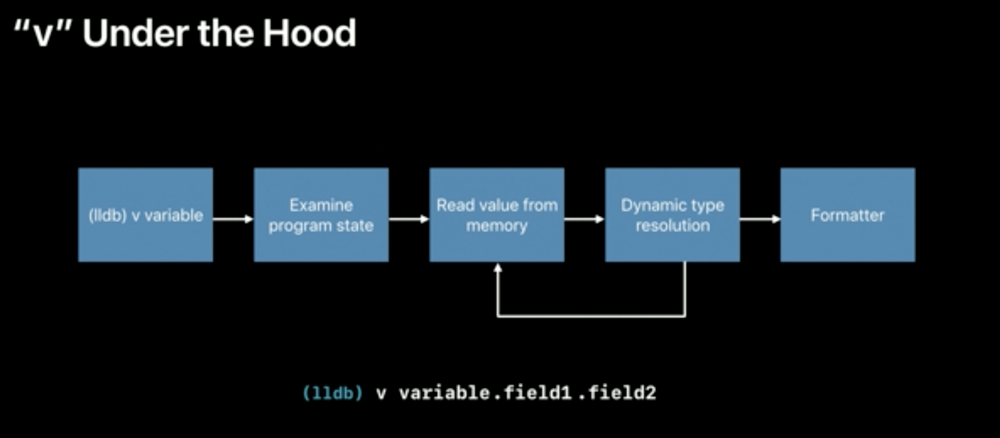

p 와 po 의 경우에는 해당 동작에 대해서 직접 컴파일 하는 반면에 v 는 현재 프로그램 상태를 확인하고 이에 대한 정보를 토대로 값을 확인할 수 있다. 아래와 같은 동작 방식을 가진다.

- 현재 프로그램 상태를 확인한다.
- memory 로 부터 값을 읽어 들인다.
- dynamic type resolution을 통해서 값에 접근한다.
- formatter를 통해서 값을 변환한다.

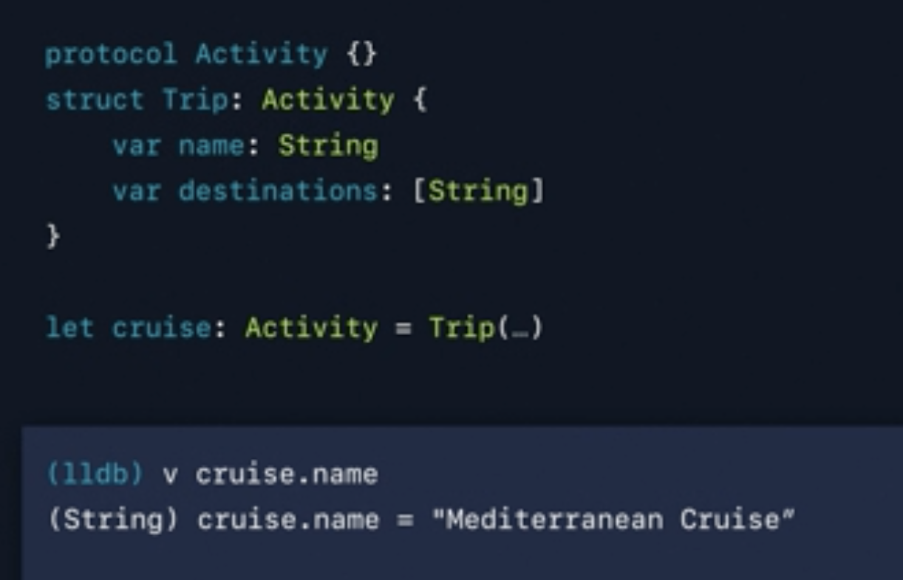

cruise 는 Activity로 선언이 되어 있지만 사실상 Trip 이다. v는 현재 상태를 확인하고 있으므로 이를 알고 있고 값을 바로 확인할 수 있다는 장점이 있다.

### Customizing Data Formmaters

이를 통해서 debugger 에 값이 어떻게 나올 지 커스터마이징 할 수 있다. 

이를 위해서 lldb는 다음과 같은 옵션을 제공한다.

- filters

    → 모든 값을 보여주는 것이 아니라 원하는 결과 값만 보여주도록 할 수 있다.

- string summaries

    → 특정 타입에 대해서 어떻게 표현할 것인지 나타낸다. 

    → LLDB는 python API 를 지원한다. 따라서 script import $$.py 를 통해서 result 를 조금 더 편하게 커스터마이징 할 수 있다.

- synthetic children

    → 이 또한 Python API 를 통해서 어떤 값을 조금 더 편하게 표기할 지 설정할 수 있다.

## conclusion

사실상 여태 po 만 확인하고 까다로운 부분은 직접 프린트를 하는 경우도 많았다. 그리고 타입과 같이 po 만으로는 안되는 경우가 종종 있었는데, 이제는 차이를 알게 되고 이를 제대로 활용하면 조금 더 빠른 디버깅 환경이 될 것이라고 생각한다.