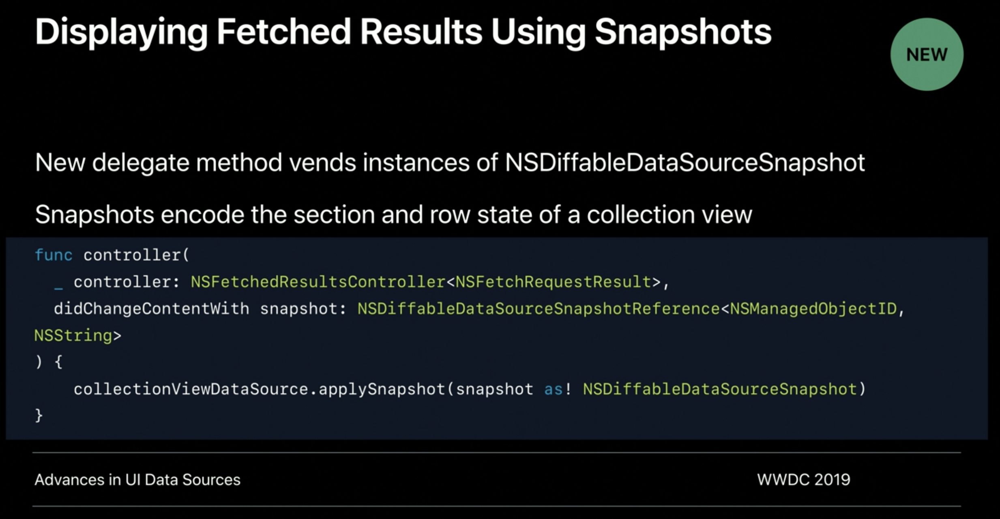

# 2019 Making apps with CoreData

[Making Apps with Core Data - WWDC 2019 - Videos - Apple Developer](https://developer.apple.com/videos/play/wwdc2019/230)

## Getting started

Posts 라는 간단한 메모 앱을 만들었다. 포스트와 태그 등으로 이루어져 있으며 태그를 통해서 포스트를 확인할 수 있다.

### Modeling Data

image 와 attatchment 사이는 1: 1 관계이며 cascade 가 적용된다. 두개의 화살표는 N을 나타낸다. 따라서 모든 관계도가 다 포함되어 있다.

### The Core data Stack

command pattern을 사용한다. 

먼저 알아 둬야 할 몇가지 중요한 객체들이 있다.

- Model ( NSManagedObjectModel )
- Store Coordinator ( NSPersistentStoreCoordinater )
    - persistent store를 관리하는 객체
- Context ( NSManagedObjectContext )
- Persistent container ( NSPersistentContainer )

코어 데이터 스택은 중요하므로 꼭 알아놓고 사용하자.

### Configuring Managed Object Contexts

뷰를 위해서는 데이터가 변경이 되더라도 안정적으로 접근이 되어야 한다. 이를 위해서 우리는 Query Generation을 사용한다. 위의 예시가 그 예이다. 이 외에도 연결된 자손들을 통해서 부모의 데이터가 변경될 여지가 있다. 이 상황을 자연스럽게 연결하고 싶다면 automaticallyMergesChangesFromParent 를 true 로 주자

context에서 작업하는 경우 가장 중요한 점은 모든 store request 는 context queue에서 작동해야 한다는 점이다. background context 는 각각 자신의 queue 를 가지고 있다. block 자체가 실행될 때 background queue 만들어서 실행하며, block이 리턴될 때 해당 큐를 해제한다. 

### 많은 양의 작업

Batch Insertions 를 통해서 많은 데이터를 한꺼번에 빠르게 처리할 수 있다. 그리고 batch delete 와 같은 기능도 있다.

### But What About ...

하지만 Batch Insertions 의 몇가지 가능성에 대해서 생각해보자

- Unique constraints
    - 만약 유일한 제약이 걸려 있고 해당 데이터를 이미 가지고 있다면 기존에 있던 데이터는 변경이 이뤄지지 않는다.
- Omitted Keys
    - 해당 키에 해당하는 값이 없다면, 기본 값이 들어가게 된다.
- Relationship
    - unique constraint 와 마찬가지로 관계는 직접 설정해야 한다.
- Notifications
    - 다른 batch 작업과 마찬가지로 notification을 처리하지 않으며 이는 개발자가 직접 처리해야 한다.

## The needs of the Controller

객체의 변경 점에 대해서 생각해보자. 가져오는 것 뿐만 아니라 동기화에 대해서도 신경을 써야 한다. 이제는 swift 자체에 combine이 포함되어 있기 때문에 이를 통해서 간단하게 처리할 수 있다. 

많은 객체를 정렬하기 위해서 sortDescriptions 를 사용할 수 있다. 또한 많은 양에 데이터를 한번에 가져오는 것은 오랜 시간이 걸릴 수 있다. 따라서 batchSize 를 설정 해서 일부분을 가져오는 것을 권장한다. 

객체를 가져오는 것에 있어서 변화에 쉽게 대응하고 싶다면 NSFetchedResultsController를 사용하자. delegate를 통해서 변화에 쉽게 대응할 수 있다. 

그리고 이 외에도 간단한 코드를 작성하면 알아서 동기화를 시켜주는 기능도 개발되어 있으니 NSDiffableDataSourceSnapshot을 확인 해보자

### Denormalization

denormalization 은 중복된 데이터를 추가 함으로써 양 자체는 늘지만 더욱 효율적으로 관리하는 방식이다. database의 인덱스가 이와 같은 방식이라고 생각하면 된다. 예를 들어서 어떤 Tag가 달린 포스트의 갯수가 필요하다고 하자 직접 array를 count 할 수 있지만,  Tag 자체에 PostCount를 추가함으로써 이와 같은 작업을 생략할 수 있다.

### Derived Attributes

CoreData managed metadata 로써 count를 포함한 여러 기능들이 이미 들어가 있다. managed object model에 정의되어 있다. 또한 모든 프로퍼티에 사용이 가능하다는 것을 알아 두자 

따라서 적절하게 활용한 derived Attributes를 통해서 denormalization을 편하게 할 수 있고, 효율을 높일 수 있다.