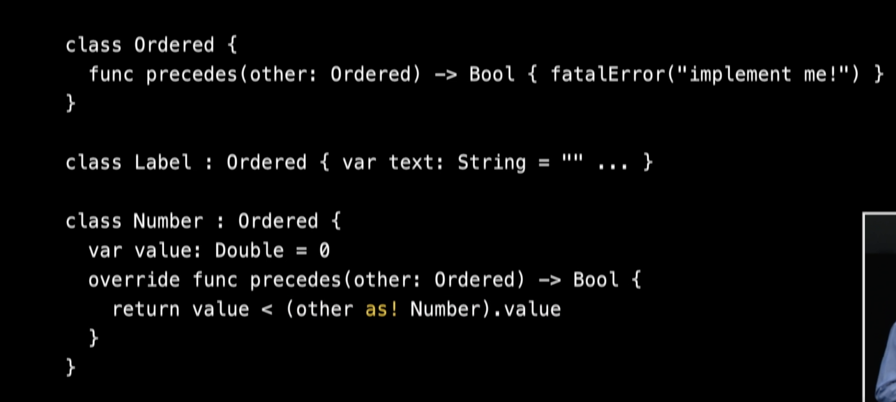
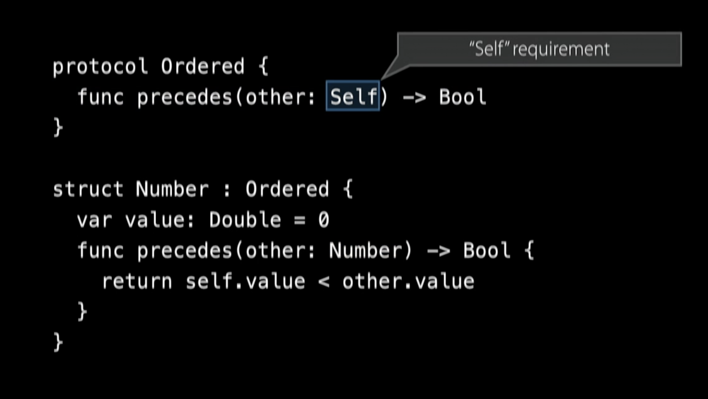
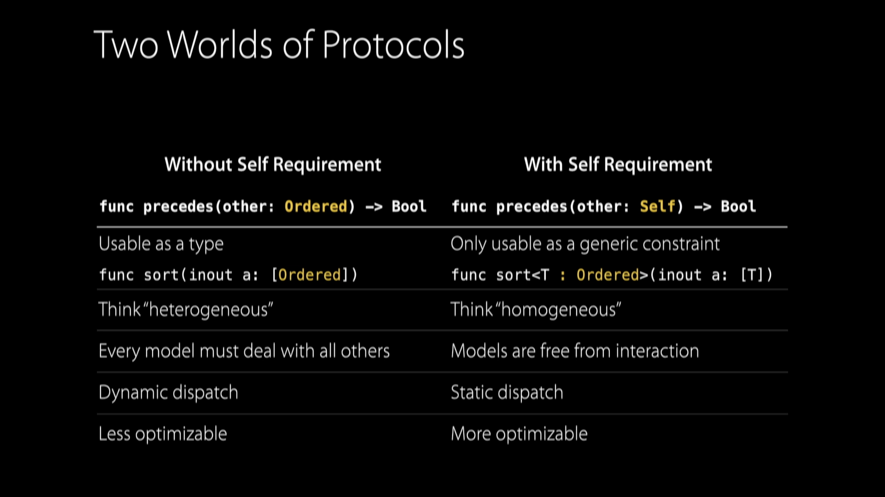
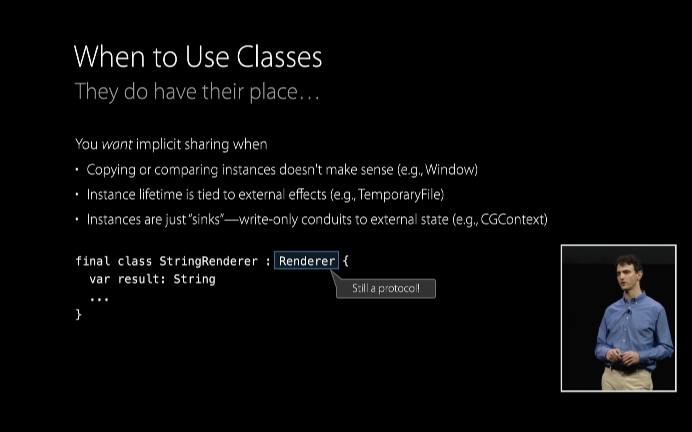
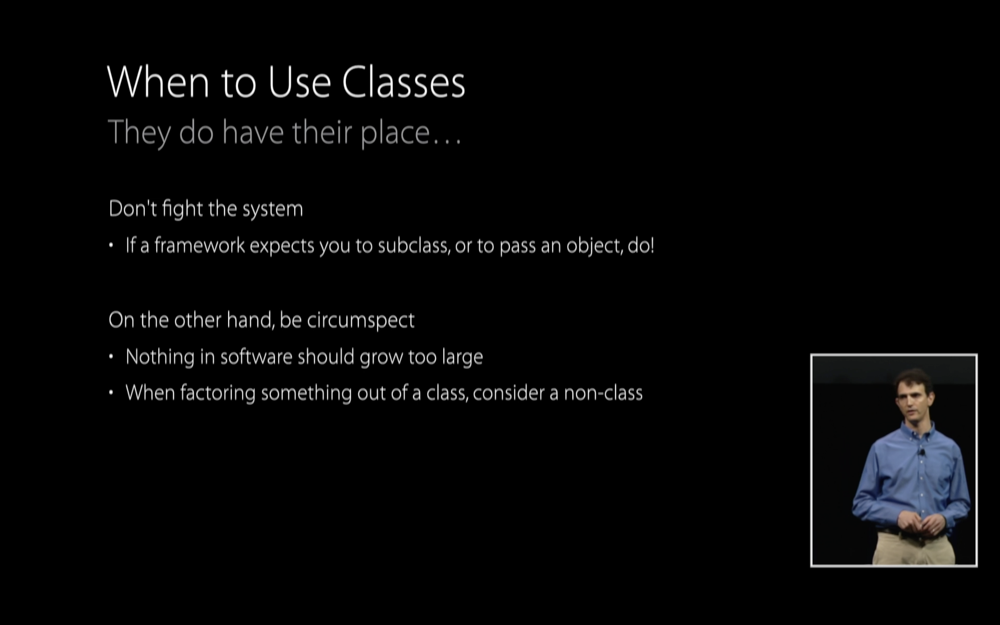

# Protocol Oriented Programming

[Protocol-Oriented Programming in Swift - WWDC 2015 - Videos - Apple Developer](https://developer.apple.com/videos/play/wwdc2015/408/?time=868)

### Protocol Oriented Programming ( 2015 session 408 )

Class 는 다음과 같은 특징 혹은 성향을 갖고 있기 때문에 여태까지 쓰여왔다.

- encapsulation
- access controll
- abstraction
- namespace ( 영역을 나누는 것 )
- expressive syntax ( chaining )
- extensibilty

이 모두는 사실 struct로도 가능하다. 그리고 enum 으로도

하지만 클래스의 가장 강력한 점은 상속이다. 굉장히 사소한 부분이라도 원하는 부분만 overrid 한다면 클래스에서 해당 함수가 호출될 때 override 된 함수가 호출된다는 점은 굉장히 매력적인 부분이라고 할 수 있다.

### The Three Beefs ( 문제점 )

1. Implicit Sharing

객체 A 와 B 가 동일한 클래스를 참조하고 있다. 이때 A에서 어떤 Dog를 Cat으로 변경 시켰다고 하자

B는 Dog를 받고 싶지만 할수 없다. 이미 Cat이 되었기 때문이다.

결국 이를 통해서 Defencive Copying 을 해야 하며, inefficiency, race conditions, more inefficiency, deadlock, complexity, bugs 가 순차적으로 발생하게 될 것이다.

2. Inheritance All Up In Your Bussiness

- 단 하나의 슈퍼 클래스를 상속한다는 점, 따라서 상속 받을 객체를 잘 선택해야 한다.
- Retroactive modeling이 불가능하다. ( 기존의 코드를 수정하지 않고 타입을 확장하는 기능이 불가능 )
- 슈퍼클래스에 stored properties가 있다면
    - 무조건 받아들여야 하며
    - 이니셜라이즈에 부담이 될 수 있으며
    - 슈퍼클래스의 룰을 깨면 안된다. ( 깰 가능성이 있다. )
- 또한 무엇을 어떻게 override 해야 하는지 혹은 하지 말아야 하는 지 알아야 한다.

    → 그래서 우리는 delegate 패턴을 사용했다.

3. Lost Type Relationships

A라는 클래스를 상속 받는다고 하자. 해당 클래스를 상속받는 모든 클래스 에는 동일한 compare 라는 function이 필요하다고 한다. 이 함수의 역할은 상속받은 클래스의 특정 value를 비교하고 Bool을 리턴하는 함수라고 가정한다.

A라는 클래스에서 해당 함수를 만들어서 한번에 쓰면 좋을 것이다. 하지만 상속 받을 클래스에 value의 존재를 A 클래스에서는 모르기 때문에 문제가 된다.

따라서 A에서는 함수를 구현 해놓고 아직 어떤 값이 조절되고 리턴 될지 모르기 때문에 fatal error 를 통해서 body를 구현 해놔야 한다. 그리고 fatalError("implement me") 라는 메세지가 있을 것이다. ( 리턴이 되지 않으면 error가 나기 때문에) 

문제는 상속 받은 클래스에서 override 할때 나타난다. as! SomeClass 를 통해서 값을 추출해야 하고 결국 Type 에 대한 관계를 잃어버릴 가능성이 생기는 것이다. 

### A Better Abstraction Mechanism

- Supports value types (and classes)

    → call by reference로 인한 side effect 를 막기 위해서

- Supports static type relationships( and dynamic dispatch )

    → type간의 관계를 확실하게 하기 위해

- Non-monolithic

    → 거대한 덩어리가 되면 안된다.

- Supports retroactive modeling

    → 타입의 확장이 용이해야 한다.

- doesn't impose instance data on models

    → 원치 않는 데이터를 가져오면 안된다.

- doesn't impose initialization durdens on models

    → 프로퍼티의 initialization을 통한 부담이 되면 안된다.

- makes clear what to implement

    → 무엇을 구현할지 

Protocol 은 해당 모든 역할을 할 수 있다.

### Swift Protocol Oriented Programming

### Start With Protocols

- Self requirement !

    

- Self requirement를 통해서 자신을 사용할 수 있고, as를 사용하지 않아도 되므로 관계에 약해지는 것을 걱정할 필요가 없다.

- protocol은 상속이 불가능 하다. 하지만 extension을 통해서 상당 부분을 대체할 수 있다.

    → 특히 기본 구현을 통해서 손쉬운 확장이 가능하다. 

- 어떤 프로토콜을 채택하는 여러 객체 들이 있을 때 protocol에 요구사항을 하나 추가하면 컴파일 에러가 난다. 이때 protocol extension으로 간단하게 구현할 수 있으며, where 를 통한 더욱 세세한 설정 까지 가능하다.

### When to use classes

- implicit sharing이 중요한 경우
    - 예를 들어서 window property 가 있다고 한다면 해당 프로퍼티를 copy 하거나 comparing 하는 것은 말이 되지 않는다.
    - 객체 자체의 life time이 중요한 경우

        → 예를 들어서 임시 파일을 만들거나 삭제한다고 하자. 메모리 자체의 reference를 참조하는 것이 필수적이기 때문에 value 타입은 적절하지 않다.

    - 단순히 테스트 혹은 값을 보기 위한 경우

- 참고로 이미 만들어진 기능들은 건드리지 말자
- 하지만 신중하게 작업하자
    - 소프트웨어에 어떤 것이던 그렇게 커질 필요가 없다.
    - 클래스를 만들때 굳이 클래스로 만들어야 하는지 생각해보자

### Summary

- protol은 superclass 보다 추상화에 더욱 강력한 점을 가지고 있다.
- extension을 활용 해보자 마법이 펼쳐진다. 끗
