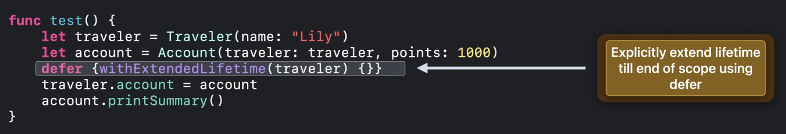
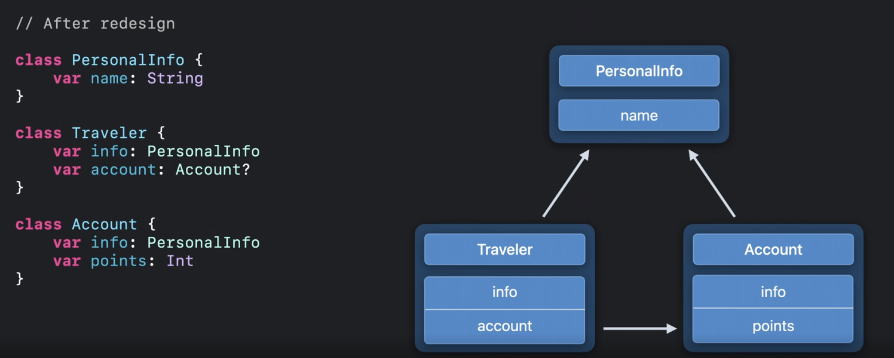

# ARC in Swift : Basics and beyond

iOS에서는 메모리 관리를 위해서 ARC라는 기법을 사용합니다. Automatic Reference Counting의 약자로 자동으로 객체의 사용을 추적하여 더 이상 사용되지 않는 경우 메모리에서 해제하는 기법입니다. 이번에 Xcode 13의 ARC 최적화에서 어떻게 변경이 되었는지 그리고 어떤 사이드 이펙트가 생길 가능성이 있는지 확인해보겠습니다. 

[해당 세션](https://developer.apple.com/videos/play/wwdc2021/10216/)을 참고하여 작성하였습니다.

# Basic

Swift에서는 값에 대한 타입으로 Reference Type 그리고 Value Type을 사용할 수 있으며 웬만하면 value Type을 사용하는 것을 추천합니다. 이유는 Reference Type을 사용하는 경우 상황에 따라서 의도치 않은 공유가 될 수 있기 때문입니다. 이때 말하는 Reference Type은 대표적으로 Closure, Class instance 등이 있습니다. 이러한 Reference Type은 ARC를 통해서 관리됩니다. 따라서 Swift를 제대로 활용하기 위해서는 ARC를 제대로 이해하는 것이 중요합니다.

객체의 생명주기를 생각해보겠습니다. 객체는 init() 에서 시작되어서 마지막 사용이 되었을 때 deallocated 됩니다. 이를 위해서 Swift 에서는 객체들을 추적해야 하고 추적을 위해서 reference Count 가 사용됩니다. 그리고 reference Count가 동작하는 방식은 Swift Compiler가 코드에 직접 retain/release 를 삽입하여 count를 증가시키거나 감소를 시킵니다. 결국 reference count가 0 이 되는 순간 더 이상 사용하지 않는다고 생각하여 deallocated 되는 것입니다. 아래 예제를 보겠습니다.

 

위의 그림은 traveler1을 기준으로 나타낸 것입니다. reference count를 증가시키는 retain 코드는 init 내부에 포함이 되어있기 때문에 컴파일러가 삽입하지 않습니다. 반면에 release코드의 경우 제대로 삽입된 것을 확인할 수 있습니다. 이는 스코프에서 traveler가 마지막으로 사용된 곳이기 때문에 아래에 삽입 되었음을 확인할 수 있습니다. 

두번째 그림은 traveler2를 기준으로 나타낸 것입니다. 처음에 사용될 때 할당으로 인해 사용이 되었기 때문에 상단에 retain 코드가 삽입되었음을 확인할 수 있습니다. 또한 마지막 사용인 traveler2.destination 아래에 release 가 삽입되었음을 확인할 수 있습니다. 위와 같은 방식으로 reference count 를 증가시키거나 감소시키는 retain/release 코드가 삽입되는 것을 확인할 수 있습니다.

위와 같은 방식은 C++ 과 같은 closing brace 에서 객체가 소멸되는 방식과 다릅니다. ARC를 통해서 객체가 관리되기 때문이고,   실제로는 마지막 사용 이후에 해제되는 경우도 많으며, 보통의 경우는 이런 객체의 생명주기는 큰 상관이 없습니다. 

실제로는 weak&unowned references, Deinitailizer 를 통해서 객체를 관찰할 수 있습니다. 이때 명백한 객체의 생명주기를 갖는 코드보다 관찰되는 생명주기를 의존하는 코드를 작성하다보면 나중에 문제가 생길 위험이 높습니다. 관찰되는 객체의 생명주기는 Compiler에게 중요한 포인트 중 하나이고 세부적인 사항이 변경될 수 있기 때문입니다. 이런 버그는 개발중에서 발견되지는 않지만, compiler의 업데이트 혹은 ARC optimization 등의 사항등을 통해서 발견될 수 있습니다.

## Observable object lifetimes

기본적으로 할당을 하게되면 strong reference 를 갖게 됩니다. 하지만 이와 다르게 waek 와 unowned 를 사용할 수도 있는데, 이의 가장 큰 특징은 ARC에 참여하지 않는다는 점입니다. 이러한 weak 와 unowned 를 사용하는 이유는 reference cycle 을 피하기 위함인데 이에 대해서 살펴보겠습니다. Reference Cycle은 뭘까요?

그림을 보면 Traveler 과 Account 가 서로 원 형태로 참조를 하고 있는 것을 확인할 수 있습니다. 이렇게 서로 참조를 하게 되면 reference count를 각각 1씩 증가시키게 됩니다. 이로 인해 Traveler Account 객체를 접근할 수 없음에도 불구하고, 0이 되어야 deallocated 되는 ARC의 특성을 본다면, 결국 해제되지 않고 메모리에 계속해서 남아있게 됩니다. 이를 메모리 누수 ( Memory leak ) 이라고 합니다.

이런 상황을 해결하기 위해서 weak, unowned 가 사용됩니다. 둘중 하나의 레퍼런스에 weak 혹은 unowned를 사용하여 둘중 하나의 참조를 통해 reference count가 증가시키지 않도록 한다면 자연스럽게 cycle이 해결됩니다.

이번에는 코드의 마지막에 printSummary 를 유의깊게 봐주시길 바랍니다. 현재는 해당 함수는 잘 동작합니다 하지만 이건 우연이라고 말하네요. account의 printSummary를 본다면 내부에서 traveler를 참조하여 값을 확인하는 것을 볼 수 있습니다. 그리고 이 traveler객체는 "Lily" 라는 이름을 갖고 있습니다. 

상단에서 말했듯이 ARC의 최적화가 진행이 된다면 객체의 생명주기는 init에서 시작되고 마지막 사용에서 종료됩니다. Traveler 의 생명주기를 생각해보면 `traveler.account = account` 까지만 사용이 됩니다. 즉 그 다음 코드에 relaese가 자동으로 삽입이 될 것이고 이 시점에서 traveler 객체는 사라지게 됩니다. 따라서 `account.printSummary()` 가 사용이 되는 시점에는 traveler는 이미 사라지고 없기 때문에 ARC의 최적화 이후에는 강제 언래핑으로 인한 런타임 에러가 발생하게 됩니다. 

사실 강제언래핑이 아닌 optional binding 을 사용하게 되는 경우 런타임 에러는 발생하지 않지만, 오히려 silent bug로 인해서 해당 문제점을 더욱 더 파악하지 못할 가능성이 높습니다. 따라서 이에 대한 해결책이 제시되어야 합니다.

WWDC에서는 이에 대한 해결책으로 3가지를 제시하였습니다. 첫번째로  `withExtendedLifetime()` 라는 메서드, 두번째로 strong reference 로 redesign 하는 것, 그리고 세번째로 weak/unowned reference 자체를 피하는 것입니다.

### 1 . withExtendedLifetime()

Swift 에서는 withExtendedLifetime() 이라는 메서드를 제공합니다. 이는 객체의 생명주기를 늘려주는 역할입니다. 그림을 보면 사실상 traveler 객체는 이미 마지막으로 사용을 했기 때문에 사라져야 합니다. 하지만 해당 메서드를 통해서 객체의 생명주기를 연장시킬 수 있습니다. 이는 위처럼 다양한 방법으로 활용이 가능합니다. 굉장히 간단하게 lifetime bug를 차단할 수 있는 방법입니다.

하지만 이 기술에는 문제점이 있는데 해당 기술에 의존하게 된다면, 결국 모든 weak/unowned reference 를 사용하는 곳에 사용이 되어야 하고 이는 결국 코드의 비대함으로 귀결이 됩니다. 

### 2 . Redesign to access via strong reference

weak 는 결국 위와 같은 silent bug를 발생시킬 위험성을 가지고 있습니다. 그렇다면 API의 위치를 변경해서 최대한 strong reference 를 사용할 수 있도록 하는 것이 좋습니다.

### 3 . Redesign to avoid weak/unowend reference

결국 weak/unowned 자체가 나온 이유는 reference cycle을 피하기 위함이었습니다. 그렇다면 애초에 reference cycle 자체를 안 만들도록 잘 설계한다면 weak/unowned를 사용하지 않아도 됩니다.

# Deinitialier side-effects

Deinitializer 는 deallocated 전에 호출이 됩니다. 이를 통해서 발생할 수 있는 side-effects를 알아보기 전에 먼저 deinitializer 에 대해서 알아보겠습니다.

현재는 "Done traveleing" 이 콘솔에 나타난 이후 "name is deinitializing" 이 콘솔에 나타납니다. 그리고 추후에 ARC의 최적화로 인해서 deinit의 시점이 변경된다면 "name is deinitializing"이 먼저 콘솔에 나타나게 될 것입니다.

이에 대한 해결책은 사실 위에서 설명한 세가지 방식으로 처리할 수 있습니다. 또한 deinitalizer 와 함께 defer를 적절하게 활용한다면 오히려 더욱 좋은 코드 설계가 될 것입니다.

# with Xcode 13

Xcode 13 부터 build setting에 Optimization Object Lifetimes가 추가되고 default 값이 Yes로 되어있습니다. 즉, 기존에 객체를 dealloc 시키는 시점과 다른 마지막으로 값을 사용한 곳에서 dealloc을 시키게 됩니다. 따라서 이를 참고하여 디버깅을 통해 안전하게 앱을 준비하는 것이 좋습니다.

