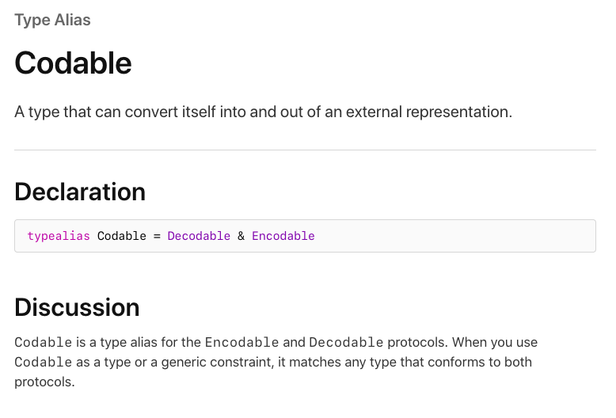
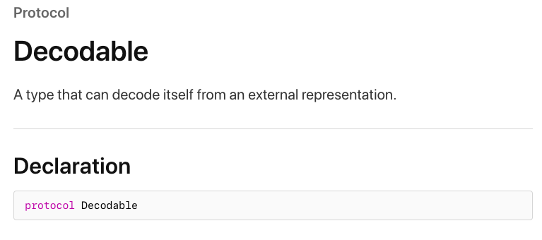
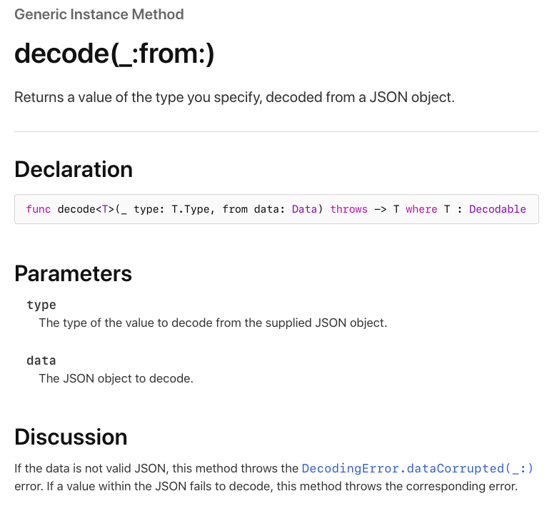
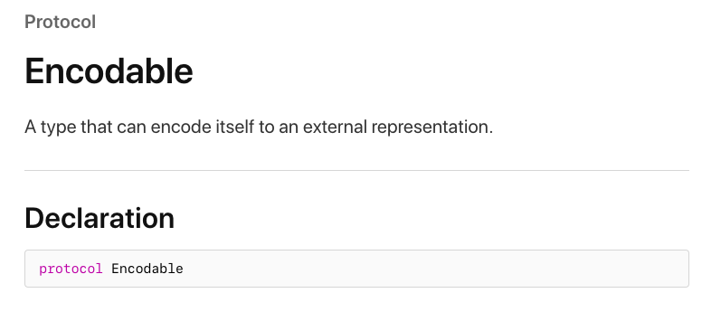
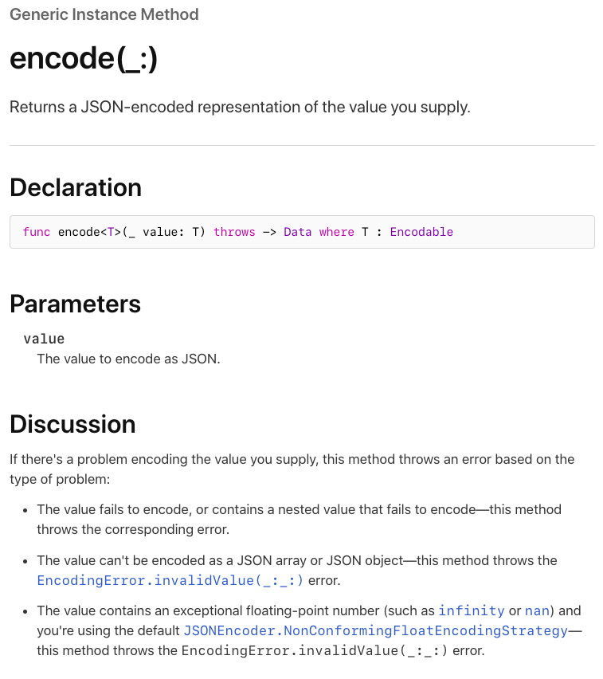

# Codable

우리는 네트워크를 통해서 데이터를 받아오는데 이때의 형식은 대부분 JSON을 사용하고는 한다. 이때 미리 정해놓은 프로토콜을 통해서 외부의 데이터와 내부의 데이터간의 전환을 도와준다. 이 프로토콜이 Codable 이다. 



Codable은 *A type that can convert itself into and out of an external representation.* 로 정의되어 있다. 즉 자신의 타입을 다른 표현으로 변경하거나 그 반대의 역할을 할 수 있도록 하는 것이 Codable 이라고 한다. 따라서 정확하게는 두개의 프로토콜을 합쳐놓은 타입 이라고 말할 수 있다.

자신의 타입을 다른 외부 표현으로 변경하는 작업을 encode라고 하고, 외부의 표현을 내부의 표현으로 변경하는 작업을 decode라고 한다. Codable은 decode를 도와주는 Decodable과 encode를 도와주는 Encodable을 채택했기 때문에 두가지의 역할을 할 수 있는것이다.

## Decodable



위에서 말했듯이 Decodable은 decode를 용이하게 한다. 즉 외부의 표현을 내부의 표현으로 바꾸는 것이다. 여기에서 외부의 표현은 JSON 형태의 데이터가 되는 것이고, 내부의 표현은 우리가 작성한 객체가 될 것이다. 다음 예시를 살펴보자

```swift
// 서버로 부터 받은 JSON Data
{"userId":1,"id":1,"title":"sunt aut facere repellat provident occaecati excepturi optio reprehenderit","body":"quia et suscipit\nsuscipit recusandae consequuntur expedita et cum\nreprehenderit molestiae ut ut quas totam\nnostrum rerum est autem sunt rem eveniet architecto"}
```

네트워크 요청을 통해서 JSON 데이터를 받아왔다. 우리가 decode를 하기 전에는 해당 데이터는 텍스트에 불과하며 직접 원하는 값을 추출하기에는 상당한 노고가 필요 할 것이다. 이를 쉽게 변경하고 우리가 원하는 키 값을 찾기 위해서 decode를 사용한다.



```swift
// JSON Data -> TestModel
struct TestModel: Decodable {
    var userId: Int
    var id: Int
    var title: String
    var body: String
}

let testModel = try! JSONDecoder().decode(TestModel.self, from: data)
```

JSON 데이터를 변환하기 위해서 JSONDecoder의 decode 함수를 캡쳐했다. 보다시피 decode는 generic method 이다. 변환되기 원하는 타입( T )에 Decodable을 채택시키고 이를 첫번째 인자로 사용한다. 두번째 인자는 jsonData를 넣으면 될 것이다. 해당 작업을 통해서 decode가 이루어지고 예시에서 보이는 것 처럼 JSON 데이터를 TestModel 이라는 객체로 사용할 수 있는 것이다.

이때 JSONDecoder 이기 때문에 JSON 형식이어야 하고, 키값이 정확해야 한다는 사실을 인지하자. 키 값이 꼭 동일할 필요는 없는데 이는 아래의 CodingKeys에서 조금 더 명확하게 설명하겠다.

## Encodable



그렇다면 이제 반대의 경우를 생각해보자. 내부의 표현을 외부의 표현으로 즉 객체를 JSON으로 바꾸는 것이다. Swift에서의 객체는 내부에서는 키와 값으로 매칭하지만 JSON 에서 어떻게 표현해줘야 할지 우리가 정해줘야 한다. Encodable을 채택한 객체는 이를 명확하게 정해줄 수 있도록 도와준다. 보통 post, fetch 등등 서버로 데이터를 보내줘야 하는 경우 사용된다.



```swift
let dataForServer = try! JSONEncoder().encode(testModel)
```

decode와 마찬가지로 encode 또한 generic type이다. Encodable을 채택한 객체를 인자로 받고 해당 객체를 JSON 형식으로 변환한 Data를 리턴한다. 

## CodingKey

위에 decode에서 설명했듯이 키 값이 꼭 서버의 형식과 동일할 필요는 없다. 예시를 들어서 설명하자면 나같은 경우는 CamelCase (HappyBirthday) 를 사용하여 변수를 지정하는 편이다. 하지만 서버에서는 SnakeCase(happy_birthday) 형식으로 값을 보내준다면 어떻게 처리해야 할까? 이를 위해서 CodingKey라는 protocol이 사용된다.

```swift
// Data From Server ( Snake Case )
{
  "name": "kan",
  "happy_birthday": 12
}

// Struct Without CodingKey < X >
struct Birthday: Decodable {
  var name: String
  var happy_birthday: Int
  // CodingKey를 사용하지 않는다면 위와 같이 서버의 네이밍 규칙에 따라야 한다.
}

// Struct With CodingKey ( CamelCase ) < O >
struct Birthday: Decodable {
  var name: String
  var happyBirthday: Int
  
  enum Codingkeys: String, CodingKey {
    case name
    case happyuBirthday = "happy_birthday"
  }
}

let birthday = try! JSONDecoder().decode(Birthday.self, from: data)
```

보이는 것 처럼 CodingKey가 없었다면 서버의 네이밍 규칙에 따라 Snake Case를 그대로 사용 했을 것이다. 물론 데이터가 변경되거나 문제가 생기는 것은 아니다. 다만 내부 규칙에 따라서 통일성있게 정리할 수 없다는 큰 단점이 있다. 이를 해결하기 위해서 아래 객체에서는 CodingKey를 채택한 CodingKeys라는 enum을 만들었다. 해당 enum을 통해서 각 프로퍼티가 어떤 네이밍 규칙을 따를지 rawValue로 정리해준다면 손쉽게 변경된 키값의 객체를 사용할 수 있다.

## 마치며

정말 초반에는 Codable의 뜻도 몰랐으며, encode와 decode도 헷갈리고 제대로 설명할 수도 없었던 기억이 난다. 해당 포스트를 통해서 조금 더 정확하게 Codable을 알고 encode와 decode를 설명할 수 있기를 바란다. 사실 encode 와 decode는 조금 더 넓은 의미를 가지고 있으며 해당 포스트에서는 JSON에 한정에서 설명한 것이므로 오해하면 안된다는 사실을 말해주고 싶다. 