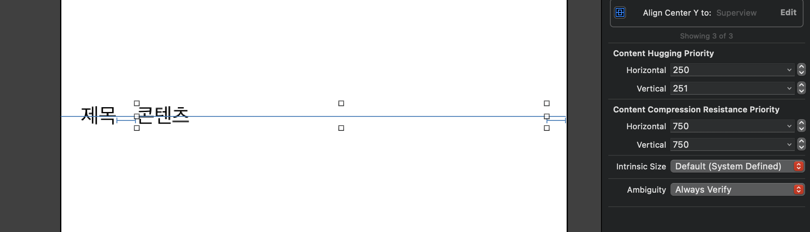
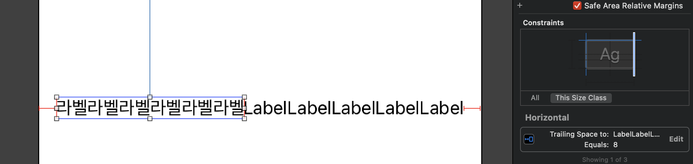
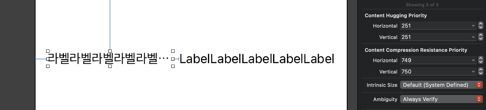
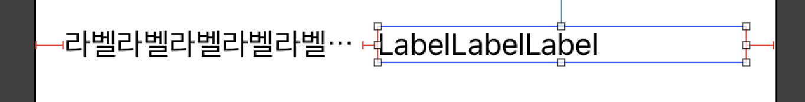
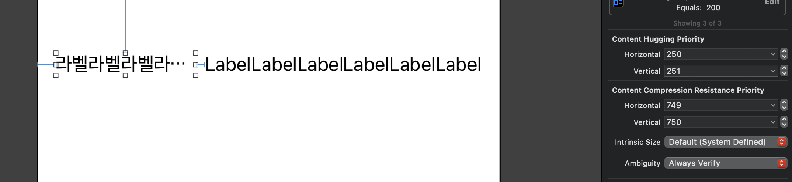
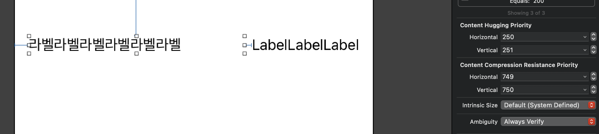

# Intrinsic Size & CHCR Priorities

글을 쓰다보니 존댓말을 쓰는 것이 조금 더 자연스러울 것 같아 이번 포스팅부터 존댓말을 쓰도록 하겠습니다 !

UI를 그리다보면 어쩔수 없이 레이아웃이 겹치는 부분 혹은 겹치지 않는 부분이 생기거나, 그 두가지가 공존하는 경우가 생기고는 합니다. 특히 라벨 버튼 등등 변동되는 텍스트를 작업할 때는 이런 상황이 생길수 밖에 없습니다. 이때마다 CHCRPriorities (ContentHugging , CompressionResistance Priority )를 사용하고는 하는데 늘 헷갈려서 찾아보고는 했습니다. 그래서 이번 기회에 정리하는 것이 좋다는 생각이 들었습니다.

핵심은 intrinsicContentSize( intrinsicSize ) 를 기준으로 생각하는 것이고 이보다 큰 경우를 대응하기 위해서는 contentHugging 을 설정하고, 이보다 작은 경우를 대응하기 위해서는 compresssionResistance 를 설정하면 됩니다.

 

## intrinsicContentSize

intrinsicContentSize(이하 intrinsicSize)란 뷰가 가지고 있는 본연의 사이즈를 말합니다. 

커스텀뷰는 일반적으로 레이아웃 시스템이 알지 못하는 방식으로 표시가 됩니다. 따라서 프로퍼티를 설정하여 콘텐츠에 맞춰서 사이즈를 시스템에 전달할 수 있도록 해야합니다. 일반적으로 커스텀뷰의 경우 내부의 콘텐츠를 레이아웃 시스템에 맞춰서 사이즈를 정해야 합니다. 이 사이즈는 변경된 높이를 기반으로 변경된 너비를 레이아웃시스템에 전달할 방법이 없기 때문에, 반드시 frame과는 무관해야 합니다.

---

대표적으로 intrinsicSize 를 갖고 있는 뷰로 UILabel 을 예시로 들수 있습니다. 자체적으로 Text 사이즈를 통해서 Label의 사이즈를 정하기 때문입니다. 따라서 UILabel 는 center를 superview 와 동일하게 잡기만 해도 layout 이 제대로 잡히는 것을 볼 수 있습니다. 이는 UIImageView 또한 마찬가지입니다.

반면에 intrinsicSize를 제대로 갖고 있지 않는 뷰의 경우는 center를 superview에 동일하게 잡더라도, 해당 뷰의 사이즈를 측정할 수 없기 때문에 layout 에러가 발생합니다. 레이아웃 시스템이 판단할 수 없기 때문입니다.

하지만 이렇게 intrinsicSize이 존재하더라도 복잡한 레이아웃이 되는 경우는 시스템이 판단할 수 없는 경우가 종종 있습니다. 이 경우를 해결하기 위해서 애플에서는 CompressionResistancePriority, ContentHuggingPriority 를 제시하여 해결할 수 있도록 하였습니다. 대부분 ContentHugging 은 250을 기본값으로 가지고 있으며, CompressionResistance 는 750을 기본값으로 갖고 있습니다. 자세한 내용은 [Auto Layout Guide](https://developer.apple.com/library/archive/documentation/UserExperience/Conceptual/AutolayoutPG/AnatomyofaConstraint.html#//apple_ref/doc/uid/TP40010853-CH9-SW1) 를 참고하시길 바랍니다.

## ContentHuggingPriority ( CH Priority )

intrinsic Size 에 비해서 더 늘어나야 하는 경우에 사용합니다. 위의 이미지를 보면 hugging 이 Text를 감싸고 있는 것을 볼 수 있습니다. 따라서 양쪽에서 압력을 가하는 정도 혹은 압력을 가하는 정도라고 해석하면 편합니다. 아래의 예제와 함께 설명하겠습니다.

여기에 두개의 라벨이 있습니다. 이때 (왼쪽)제목 라벨은 고정이고, (오른쪽)콘텐츠 라벨은 텍스트의 사이즈가 늘어날 수 있으며, 서로의 거리는 16 이상이 되어야 한다면 어떻게 해야할까요?

1. 라벨간의 거리를 16으로 제약을 겁니다.
2. 늘어나야하는 라벨 ( 콘텐츠 라벨 )의 contentHugging 을 고정된 라벨보다 낮게 측정합니다.

1번을 진행한다면 레이아웃이 깨지는 현상을 확인할 수 있습니다. 라벨들의 기본 intrinsicSize는 텍스트의 사이즈에 따라서 결정이 됩니다. 그렇기 때문에 적절한 텍스트를 적는다면 16의 제약을 만족할 수 있겠지만 위와 같은 일반적인 상황은 그렇지 않기 때문에 주어진 레이아웃을 만족하기는 어렵습니다.

따라서 2번의 제약을 걸어야 합니다. 오른쪽에 content Hugging 을 낮춰 왼쪽에 비해 오른쪽이 양쪽에서 안아주는 압력이 낮아지도록 하여 크기를 상대적으로 커질 수 있도록 하는 것입니다. 이를 통해 오른쪽 라벨의 width를 intrinsicSize 보다 키워서 16의 제약조건을 만족할 수 있도록 하는 것입니다.

## CompressionResistancePriority ( CR Priority )

CompressionResistance는 intrinsicSize 에 비해서 줄어 들어야 하는 경우 사용합니다. 만약 두개의 라벨의 intrinsicSize가 너무 커서 레이아웃을 만족할 수 없다면 어떻게 될까요? 이런 경우에 사용하는 프로퍼티가 CompressionResistancePriority 입니다. 압축을 저항하는 정도로 해석하면 편합니다.

위에서 말한 상황과 동일한 경우를 재현하였습니다. 양 라벨과의 거리 제약은 16이며 왼쪽 라벨의 사이즈를 작게하고 싶습니다. 이 경우 압축에 저항하는 정도를 낮춘다 > 더 압축된다 라고 생각하면 되기 때문에 왼쪽의 라벨의 compression Resistance 를 낮추면 해결될 것 같습니다. 왼쪽 라벨의 경우 priorty가 749 이며, 오른쪽 라벨이 750 입니다. 따라서 압축을 저항하는 정도 ( compression Resistance ) 가 왼쪽라벨이 더 낮기 때문에, 크기가 intrinsicSize 보다 작아지게되어 왼쪽 라벨이 줄어들게 됩니다.

## CHCR Priorities ( ContentHugging & CompressionResistance )

그렇다면 이 두개를 동시에 사용하는 일이 있을까요? 네 있습니다. 위에서도 설명했듯이 CHCR Priority 는 intrinsicSize 를 기준으로 합니다. 따라서 상황에 따라서는 두가지를 모두 정확하게 작성을 해야 어느 텍스트가 들어오더라도 의도된 UI가 나올 것입니다.

CompressionResistancePriority를 설정한 예제에서 오른쪽 라벨의 intrinsic 사이즈만 줄인 경우입니다. 보시다시피 레이아웃이 시스템에 적절하지 않습니다. 이유는 ContentHuggingPriority가 동일하기 때문에 어떤 라벨의 사이즈를 더 키워야 할지 시스템에서는 모르기 때문입니다.

예시로 왼쪽의 라벨의 크기를 유동적으로 하는것으로 하겠습니다. 왼쪽 라벨의 CHPriority를 낮추는 경우 intrinsicSize가 작아 제약조건을 만족하지 못할때 왼쪽의 라벨이 커지게 되고, intrinsicSize 가 커서 제약조건을 넘어가는 경우 왼쪽 라벨의 크기가 줄어들게 됩니다.

## 마무리

이렇게 ContenteHugging 그리고 CompressionResistance Priority 에 대해 알아봤습니다. 활용할 부분도 굉장히 많고 UI 디버깅을 진행하다보면 다른 부분에서도 Priority 가 많이 적용된 것을 확인할 수 있습니다. 관심있게 보신다면 좋은 UI 작성 방식이 될 것이라고 생각합니다.

## Reference 

[Apple - AutoLayoutGuide](https://developer.apple.com/library/archive/documentation/UserExperience/Conceptual/AutolayoutPG/AnatomyofaConstraint.html#//apple_ref/doc/uid/TP40010853-CH9-SW1)

https://developer.apple.com/documentation/uikit/uiview/1622600-intrinsiccontentsize